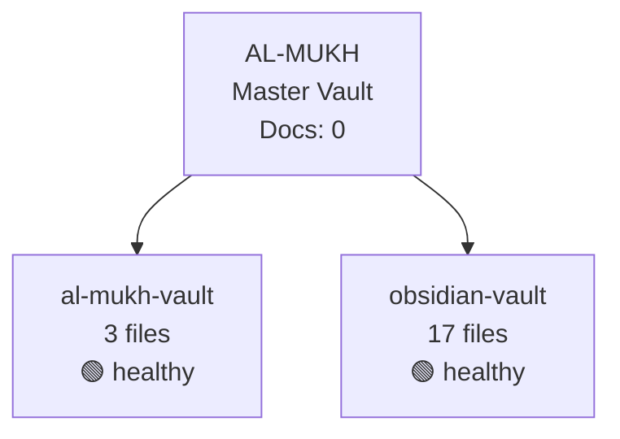
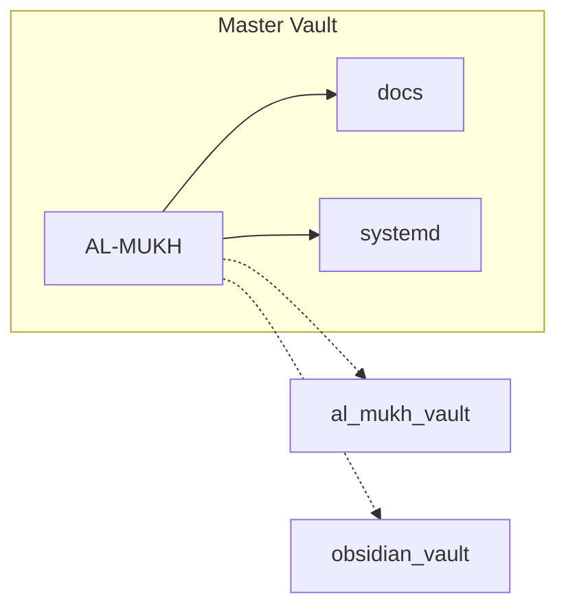

# AL-MUKH Global Map
> Auto-generated: 2026-07-25 15:01:56

---

## Spoke Network

---

## Spoke Details

| Spoke | Path | Files | Size | Status | Last Modified |
|-------|------|-------|------|--------|---------------|
| `al-mukh-vault` | `/home/kali/AL-MUKH` | 3 | 8.3 KB | 🟢 healthy | 2026-07-25 11:20 |
| `obsidian-vault` | `/home/kali/Documents/Obsidian Vault` | 17 | 137.5 KB | 🟢 healthy | 2026-07-25 14:46 |

---

## Namespace Hierarchy

