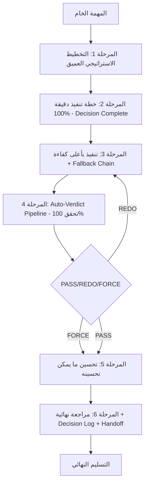

# Swarm Deep Thinking Skill — نظام تفكير عميق 6 مراحل

> **النسخة:** 1.0.0 | **التحديث:** 2026-07-19 | **مستوحى من:** Anthropic (50%) + OpenAI (40%) + Google (10%)

---

## 🎯 **الغرض**

توفير إطار تفكير عميق موحد للسرب يمر بـ **6 مراحل متسلسلة** تضمن:
- تحليل استراتيجي شامل قبل أي تنفيذ
- خطة قرار كاملة (Decision Complete) لا تترك أي قرار للمنفذ
- تنفيذ بأعلى كفاءة مع Fallback Chain
- تحقق آلي 100% (Auto-Verdict Pipeline)
- تحسين مستمر قبل التسليم النهائي
- مراجعة نهائية مع Decision Log و Handoff Package

---

## 🏗️ **الهيكل العام للمراحل الـ 6**



---

## 📋 **تفاصيل كل مرحلة**

---

### **المرحلة 1: التخطيط الاستراتيجي العميق (Deep Strategic Planning)**

**الهدف:** فهم المهمة من كل الزوايا قبل أي خطوة تنفيذية.

**المدخلات:** المهمة الخام + سياق السرب (العمال، المهارات، القيود)

**العملية (مستوحى من Anthropic Research-First + OpenAI Plan Mode Phase 1):**

```
┌─────────────────────────────────────────────────────────────┐
│ STAGE 1: DEEP STRATEGIC PLANNING                            │
├─────────────────────────────────────────────────────────────┤
│ 1.1 Task Decomposition                                       │
│    • تفكيك المهمة إلى مكونات ذرية                            │
│    • تحديد: Goal، Success Criteria، Constraints، Audience    │
│    • رسم Dependency Graph بين المكونات                       │
│                                                              │
│ 1.2 Risk & Unknown Mapping                                   │
│    • Known Knowns: ما نعرفه بثقة                             │
│    • Known Unknowns: ما نعلم أننا نجهلها (يحتاج بحث)          │
│    • Unknown Unknowns: مناطق عمياء (يحتاج استكشاف)           │
│                                                              │
│ 1.3 Resource & Capability Assessment                         │
│    • مطابقة المهمة مع مهارات العمال الـ 8                     │
│    • تحديد الثغرات في المهارات/الأدوات                        │
│    • تقدير التعقيد: Simple / Medium / Complex                │
│                                                              │
│ 1.4 Deep Research Trigger (Anthropic: launch_extended_search)│
│    • إذا >10% احتمال تغير الحقائق → Web Search إلزامي        │
│    • Right-Inference Rule: لا استنتاجات بدون دليل             │
│    • Domain Isolation: لا نقل تفضيلات عبر المجالات           │
│                                                              │
│ 1.5 Strategic Plan Output                                    │
│    • StrategicPlan.md مع: Goals، Risks، Resources، Research  │
└─────────────────────────────────────────────────────────────┘
```

**المخرجات:** `StrategicPlan.md`

**أدوات مستخدمة:** `web_search` (إلزامي للحقائق الزمنية)، `python` (للحسابات)، `analysis channel` (Hidden CoT)

---

### **المرحلة 2: خطة تنفيذ دقيقة 100% - Decision Complete (Implementation Planning)**

**الهدف:** خطة لا تترك **أي قرار** للمنفذ — Decision Complete (مستوحى من OpenAI Codex Plan Mode Phase 3).

**المدخلات:** `StrategicPlan.md`

**العملية:**

```
┌─────────────────────────────────────────────────────────────┐
│ STAGE 2: DECISION-COMPLETE IMPLEMENTATION PLAN              │
├─────────────────────────────────────────────────────────────┤
│ 2.1 Task Atomicity                                           │
│    • تفكيك إلى Atomic Tasks (كل مهمة = خطوة واحدة واضحة)     │
│    • كل مهمة: Input محدد، Output محدد، Success Criteria      │
│                                                              │
│ 2.2 Interface & Data Flow Specification                      │
│    • APIs/Schemas/I/O لكل مهمة                               │
│    • Data Flow Diagram بين العمال                             │
│    • Error Handling & Fallback لكل واجهة                     │
│                                                              │
│ 2.3 Edge Cases & Failure Modes                               │
│    • قائمة شاملة بحالات الحافة لكل مهمة                      │
│    • Recovery Strategy لكل فشل محتمل                         │
│                                                              │
│ 2.4 Testing & Acceptance Criteria                            │
│    • Unit Tests لكل مكون                                      │
│    • Integration Tests للتدفقات                              │
│    • Acceptance Criteria قابلة للقياس (Pass/Fail واضح)        │
│                                                              │
│ 2.5 Rollout & Monitoring Plan                                │
│    • Deployment Strategy                                      │
│    • Monitoring Metrics                                       │
│    • Rollback Procedure                                       │
│                                                              │
│ 2.6 Assumptions & Defaults (Locked)                          │
│    • كل افتراض موثق ومغلق (لا قرارات للمنفذ)                 │
│    • Tradeoffs موثقة مع التبرير                               │
│                                                              │
│ 2.7 ImplementationPlan.md Output                             │
│    • قابل للتنفيذ مباشرة بواسطة أي عامل                       │
└─────────────────────────────────────────────────────────────┘
```

**المخرجات:** `ImplementationPlan.md` (Decision Complete)

**قاعدة ذهبية:** *إذا احتاج المنفذ لاتخاذ أي قرار → الخطة ناقصة*

---

### **المرحلة 3: التنفيذ بأعلى كفاءة + Fallback Chain (High-Efficiency Execution)**

**الهدف:** تنفيذ الخطة بالتوازي مع مراقبة مستمرة و Fallback ذكي.

**المدخلات:** `ImplementationPlan.md`

**العملية (مستوحى من السرب الحالي + OpenAI Autonomy + Google Sub-Agent Delegation):**

```
┌─────────────────────────────────────────────────────────────┐
│ STAGE 3: HIGH-EFFICIENCY EXECUTION                          │
├─────────────────────────────────────────────────────────────┤
│ 3.1 Parallel Dispatch Strategy                               │
│    • Coordinator يقرر: Simple(1) / Medium(3-4) / Complex(8)  │
│    • Task() بالتوازي للعمال المستقلين                        │
│    • Sequential فقط حيث توجد Dependencies                    │
│                                                              │
│ 3.2 Skill-Worker Matching                                    │
│    • كل مهمة → العامل الأنسب (Skill + Model + Domain)        │
│    • Context Injection: مهمة + دور + مهارات + Constraints    │
│                                                              │
│ 3.3 Progress Tracking (Todo List - Anthropic Cowork Style)   │
│    • TaskCreate لكل مهمة فرعية                                │
│    • TaskUpdate: pending → in_progress → completed          │
│    • Verification Step إلزامي لكل مهمة                       │
│                                                              │
│ 3.4 Fallback Chain (السرب الحالي محسن)                       │
│    ├── Attempt 1: العامل الأساسي                              │
│    ├── Attempt 2: نفس العامل مع سياق موسع                    │
│    ├── Attempt 3: عامل بديل بنفس المجال (Fallback Model)     │
│    └── Attempt 4: swarm-worker-qa (Nemotron 3 Ultra)        │
│                                                              │
│ 3.5 Logging & Observability                                  │
│    • كل شيء في .opencode/logs/swarm-YYYYMMDD-HHMMSS.jsonl    │
│    • Structured Logs: Timestamp، Worker، Action، Result      │
│                                                              │
│ 3.6 Intermediate Artifacts Collection                        │
│    • جمع مخرجات العمال: Code، Docs، Tests، Reports           │
│    • تمر للمرحلة 4 فور الانتهاء                              │
└─────────────────────────────────────────────────────────────┘
```

**المخرجات:** مخرجات العمال + Logs + Intermediate Artifacts

---

### **المرحلة 4: Auto-Verdict Pipeline — تحقق 100% (Auto-Verdict Pipeline)**

**الهدف:** تحقق آلي شامل — **PASS / REDO / FORCE** — لا يمر شيء دون تحقق.

**المدخلات:** مخرجات العمال من المرحلة 3

**العملة (Pipeline محسن من السرب الحالي + Anthropic Verification Step + OpenAI Auto-Review):**

```
┌─────────────────────────────────────────────────────────────┐
│ STAGE 4: AUTO-VERDICT PIPELINE (12 خطوة)                    │
├─────────────────────────────────────────────────────────────┤
│                                                              │
│ 4.1  P0 - Final Triage Check                                │
│     • هل المخرجات تجيب على الهدف الاستراتيجي؟               │
│     • هل هناك Missing Requirements؟                          │
│                                                              │
│ 4.2  Tool Planning Verification                              │
│     • هل الأدوات المستخدمة صحيحة ومحدثة؟                    │
│     • هل هناك Tools غير مستخدمة كان يجب استخدامها؟           │
│                                                              │
│ 4.3  Execute Verification                                    │
│     • هل الكود يعمل؟ (Build + Run + Tests Pass)              │
│     • هل المخرجات تطابق Success Criteria المرحلة 2؟          │
│                                                              │
│ 4.4  Quality Review (Code Quality + Gaps)                   │
│     • Code Reviewer + Security Reviewer + Clean Code Guard  │
│     • Logic Errors، Duplication، Complexity، Injections     │
│     • Input Validation، Edge Cases                          │
│                                                              │
│ 4.5  Design Review (UX + Architecture)                      │
│     • UX Designer + Architect Review                        │
│     • Consistency، Accessibility، Scalability               │
│                                                              │
│ 4.6  Adversarial Review (Red Team)                          │
│     • The Fool / Critic Perspective                         │
│     • Pre-mortem: "ماذا لو فشل هذا في الإنتاج؟"              │
│     • Attack Surface Analysis                               │
│                                                              │
│ 4.7  Domain Check (Specialized Knowledge)                   │
│     • Domain Expert Review لكل مجال مشارك                  │
│     • Best Practices Compliance                             │
│                                                              │
│ 4.8  Multi-Angle Review (Cross-Cutting)                     │
│     • Security + Performance + Maintainability + Cost       │
│     • Dependency Impact Analysis                            │
│                                                              │
│ 4.9  MCP Check (Model Context Protocol)                     │
│     • MCP Servers المستخدمة صحيحة؟                         │
│     • Context Injection كاملة؟                               │
│                                                              │
│ 4.10 Test Execution (Automated)                             │
│      • Unit Tests + Integration Tests + E2E Tests           │
│      • Coverage Thresholds: ≥80%                            │
│                                                              │
│ 4.11 Auto-Verdict Calculation                               │
│       ┌─────────────────────────────────────────────────┐   │
│       │ PRIME: Python3 (decimal precision)              │   │
│       │ FALLBACK: bc (basic calculator)                 │   │
│       │ Scores من 5 مراجعين × أوزان محددة               │   │
│       │ PASS ≥ 85% | REDO 70-84% | FORCE < 70%         │   │
│       └─────────────────────────────────────────────────┘   │
│                                                              │
│ 4.12 Clean Synthesis                                         │
│      • تجميع المخرجات المجتازة                               │
│      • توثيق القرارات في DecisionLog.md                     │
│      • إعداد Handoff Package للمرحلة 6                      │
│                                                              │
└─────────────────────────────────────────────────────────────┘
```

**المخرجات:** `VerificationReport.md` مع الحكم: **PASS / REDO / FORCE**

| الحكم | المعنى | الإجراء |
|-------|--------|---------|
| **PASS** | ≥85% | انتقال للمرحلة 5 |
| **REDO** | 70-84% | عودة للمرحلة 3 مع ملاحظات محددة |
| **FORCE** | <70% | تصعيد للخبير البشري / إعادة تخطيط جذري |

---

### **المرحلة 5: تحسين ما يمكن تحسينه (Continuous Improvement)**

**الهدف:** Refactoring، Performance، Quality — قبل التسليم النهائي.

**المدخلات:** مخرجات PASS من المرحلة 4

**العملية:**

```
┌─────────────────────────────────────────────────────────────┐
│ STAGE 5: CONTINUOUS IMPROVEMENT                             │
├─────────────────────────────────────────────────────────────┤
│                                                              │
│ 5.1 Code Quality Improvements                                │
│     • Refactoring: DRY، SOLID، Clean Code                   │
│     • إزالة التكرار (Duplication Removal)                   │
│     • توحيد الأنماط (Pattern Unification)                   │
│                                                              │
│ 5.2 Performance Optimization                                 │
│     • Profiling: Hot Paths، Bottlenecks                     │
│     • Caching Strategy، Lazy Loading، Parallelization       │
│     • Memory/CPU Optimization                               │
│                                                              │
│ 5.3 Security Hardening                                       │
│     • Input Validation 강화، Output Encoding                │
│     • Secrets Management، Least Privilege                   │
│     • Dependency Vulnerability Scan                         │
│                                                              │
│ 5.4 Documentation & Maintainability                          │
│     • API Docs، README، Architecture Decision Records (ADR) │
│     • Code Comments للlogic المعقد                           │
│     • Runbook للعمليات الحرجة                               │
│                                                              │
│ 5.5 ImprovementLog.md                                        │
│     • ما تم تحسينه + التأثير المقاس (Before/After)           │
│     • الديون التقنية المتبقية (Technical Debt Log)          │
│                                                              │
└─────────────────────────────────────────────────────────────┘
```

**المخرجات:** مخرجات محسنة + `ImprovementLog.md`

---

### **المرحلة 6: المراجعة النهائية الدقيقة (Final Meta-Review & Handoff)**

**الهدف:** ضمان التسليم الكامل مع Decision Log و Handoff Package.

**المدخلات:** كل المخرجات من المراحل 1-5

**العملية (Meta-Review - مستوحى من Google Compliance Checklist + Anthropic Decision Log):**

```
┌─────────────────────────────────────────────────────────────┐
│ STAGE 6: FINAL META-REVIEW & HANDOFF                        │
├─────────────────────────────────────────────────────────────┤
│                                                              │
│ 6.1 Strategic Goal Alignment Check                           │
│     • هل حققنا StrategicPlan.md Goals؟                       │
│     • Success Criteria: Met / Partially Met / Not Met       │
│                                                              │
│ 6.2 Compliance Checklist (Hard Fail Checks - Gemini Style)  │
│     ┌─────────────────────────────────────────────────────┐  │
│     │ □ Hard Fail 1: هل استخدمت عبارات محظورة؟           │  │
│     │ □ Hard Fail 2: هل استخدمت بيانات بلا قيمة مضافة؟    │  │
│     │ □ Hard Fail 3: هل تضمنت بيانات حساسة بلا داعٍ؟      │  │
│     │ □ Hard Fail 4: هل تجاهلت توجيهات User Corrections؟  │  │
│     │ □ Hard Fail 5: هل كل الادعاءات الواقعية مدعومة؟    │  │
│     │ □ Hard Fail 6: هل Verification Step شملت كل مهمة؟   │  │
│     │ □ Hard Fail 7: هل Citations موجودة لكل الادعاءات؟   │  │
│     └─────────────────────────────────────────────────────┘  │
│                                                              │
│ 6.3 Decision Log (Anthropic Style)                           │
│     • كل قرار رئيسي: السياق، البدائل، الاختيار، التبرير     │
│     • Tradeoffs موثقة مع الأرقام                            │
│     • Lessons Learned: ما نجح، ما فشل، ما سيتغير لاحقاً     │
│                                                              │
│ 6.4 Technical Debt & Known Limitations                       │
│     • ديون تقنية مقصودة مع خطة سداد                         │
│     • Known Limitations مع Workarounds                      │
│                                                              │
│ 6.5 Handoff Package Generation                               │
│     ┌─────────────────────────────────────────────────────┐  │
│     │ HandoffPackage/                                     │  │
│     │ ├── FinalReport.md (Executive Summary)              │  │
│     │ ├── StrategicPlan.md                                │  │
│     │ ├── ImplementationPlan.md                           │  │
│     │ ├── VerificationReport.md (PASS)                    │  │
│     │ ├── ImprovementLog.md                               │  │
│     │ ├── DecisionLog.md                                  │  │
│     │ ├── TechnicalDebtLog.md                             │  │
│     │ ├── Runbook.md (للعمليات الحرجة)                    │  │
│     │ └── Artifacts/ (Code، Tests، Docs، Configs)         │  │
│     └─────────────────────────────────────────────────────┘  │
│                                                              │
│ 6.5 Final Verdict: READY FOR PRODUCTION / NEEDS WORK        │
│                                                              │
└─────────────────────────────────────────────────────────────┘
```

**المخرجات النهائية:** `FinalReport.md` + `DecisionLog.md` + `HandoffPackage/` + **Final Verdict**

---

## 🔧 **الأدوات والقنوات المطلوبة**

### **Hidden Chain-of-Thought (Analysis Channel) - مثل GPT-5:**
```json
{
  "analysis": {
    "description": "Channel for internal reasoning, calculations, and chain-of-thought. NOT visible to user.",
    "tools": ["python", "web_search", "calculation"]
  }
}
```

### **Python Tool للتفكير الداخلي:**
- الحسابات الدقيقة (decimal precision)
- تحليل البيانات المعقدة
- محاكاة السيناريوهات

### **Web Search إلزامي (OpenAI Style):**
- للحقائق الزمنية (>10% احتمال تغير)
- للتحقق من الادعاءات الواقعية
- مع Citations إلزامية (5 most load-bearing statements)

### **Todo List + Verification Step (Anthropic Cowork):**
- TaskCreate لكل مهمة فرعية
- Verification Step إلزامي قبل إكمال أي مهمة
- TaskUpdate: pending → in_progress → completed

### **Compliance Checklist (Gemini Style):**
- 7 Hard Fail Checks قبل كل رد نهائي
- لا يتم تجاوز أي Check

---

## 📁 **الملفات المنتجة في كل تشغيل**

```
swarm-run-YYYYMMDD-HHMMSS/
├── StrategicPlan.md              # المرحلة 1
├── ImplementationPlan.md         # المرحلة 2 (Decision Complete)
├── WorkerOutputs/                # المرحلة 3
│   ├── innovator.md
│   ├── critic.md
│   ├── architect.md
│   ├── explorer.md
│   ├── reviewer.md
│   ├── reasoner.md
│   ├── vision-coder.md
│   └── swarm-worker-qa.md
├── Logs/
│   └── swarm-YYYYMMDD-HHMMSS.jsonl
├── VerificationReport.md         # المرحلة 4 (PASS/REDO/FORCE)
├── ImprovementLog.md             # المرحلة 5
├── DecisionLog.md                # المرحلة 6
├── TechnicalDebtLog.md           # المرحلة 6
├── FinalReport.md                # المرحلة 6
└── HandoffPackage/
    ├── FinalReport.md
    ├── StrategicPlan.md
    ├── ImplementationPlan.md
    ├── VerificationReport.md
    ├── ImprovementLog.md
    ├── DecisionLog.md
    ├── TechnicalDebtLog.md
    ├── Runbook.md
    └── Artifacts/
```

---

## ⚙️ **إعدادات التكامل مع السرب**

### **في opencode.json (برومبت السرب):**
- استبدال قسم TRIAGE + EXECUTE + REVIEW بالمراحل الـ 6
- إضافة `analysis` channel للـ Hidden CoT
- إضافة `python` tool للتفكير الداخلي
- إضافة `web_search` tool مع قواعد MUST USE
- إضافة Verification Step إلزامية
- إضافة Compliance Checklist في النهاية

### **في SKILL.md:**
- إضافة قسم "Deep Thinking Pipeline" مع وصف المراحل
- إشارة لـ `DEEP_THINKING_SKILL.md` كمهارة مستقلة

---

## �