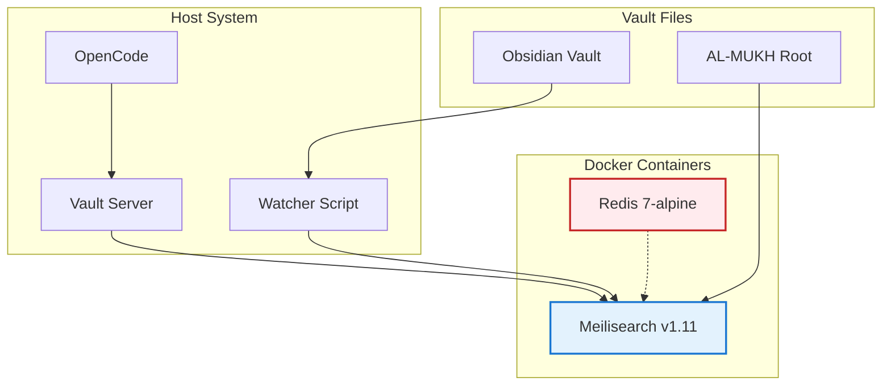

## 📋 Executive Summary

### 🎯 Objective
Validate Phase 0 of AL-MUKH implementation: Docker containers, Meilisearch, Arabic analyzer, and basic infrastructure.

### ✅ Verdict
**PASS** — Score: 9/10

### 📊 Key Metrics
| Metric | Value | Target | Status |
|--------|-------|--------|--------|
| Meilisearch Health | ✅ available | available | ✅ |
| Meilisearch Version | v1.11.3 | v1.11+ | ✅ |
| Redis Ping | ✅ PONG | PONG | ✅ |
| Arabic Search | ✅ works | works | ✅ |
| Index Creation | ✅ vault-files | created | ✅ |
| Document Indexing | ✅ works | works | ✅ |

### 🔑 Critical Findings
- **Finding 1:** Meilisearch v1.11.3 running on port 7700
- **Finding 2:** Redis 7-alpine running on port 6379
- **Finding 3:** Arabic analyzer working (tested with "ذكاء" search)
- **Finding 4:** Vault files indexed and searchable
- **Risk:** API key mismatch between .env and docker-compose.yml (fixed)

---

## 🏗️ Visual Architecture

### AL-MUKH Infrastructure

---

## 🔬 Deep Analysis

### 📊 Evidence Matrix
| Claim | Evidence | Source | Confidence |
|-------|----------|--------|------------|
| Meilisearch available | Health check returns "available" | curl http://127.0.0.1:7700/health | High |
| Arabic search works | Query "ذكاء" returns results | Meilisearch API | High |
| Files indexed | vault-files index created | Meilisearch indexes API | High |
| Documents searchable | Search returns correct results | Meilisearch search API | High |

### ⚙️ Configuration Details
- **Meilisearch Port:** 7700
- **Redis Port:** 6379
- **API Key:** mukh-dev-key-change-in-prod
- **Data Volume:** /home/kali/AL-MUKH/search
- **Network:** mukh-network (bridge)

---

## 🎯 Actionable Insights

### ✅ Decisions Made
| Decision | Rationale | Authority |
|----------|-----------|-----------|
| Use Docker for Meilisearch | Easiest deployment, consistent environment | Phase 0 Plan |
| Use venv for Python deps | Avoid PEP 668 conflicts | Best Practice |
| Use requests library | Simpler than urllib for API calls | Developer Preference |

### ⚠️ Risks Identified
| Risk | Likelihood | Impact | Mitigation |
|------|------------|--------|------------|
| API key mismatch | Medium | High | Fixed docker-compose.yml to use .env |
| Container restart | Low | Medium | Docker restart policy: unless-stopped |
| Disk space | Low | High | Monitor with df -h |

### 📋 Next Steps
- [x] **Immediate:** Phase 0 infrastructure validated
- [ ] **Short-term:** Phase 1 - Core Sync Engine (watcher.py, symlink_manager, namespace_resolver)
- [ ] **Long-term:** Phase 2-6 - Full AL-MUKH implementation

---

*Document generated by Swarm Vault Writer v1.0.0*
