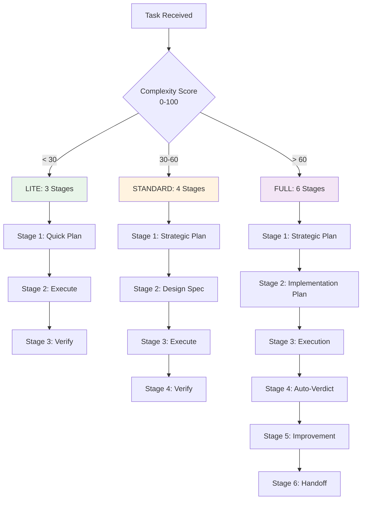
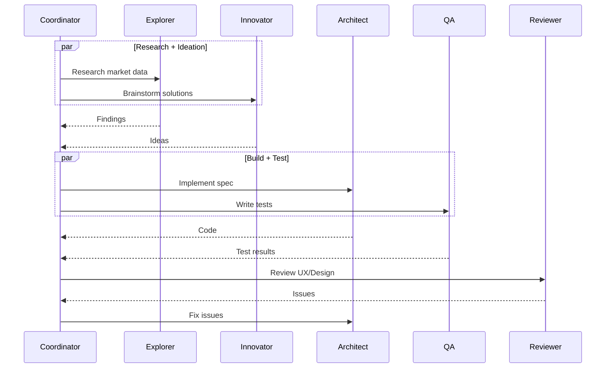

# 🐝 Swarm Agent System — Execution Plan & Pipeline Specification

## Overview

This document specifies the **exact execution flow** for the Swarm Agent System's 6-stage deep thinking pipeline. Every task entering the system follows this specification — no deviations allowed. The pipeline is defined in the Coordinator's system prompt (`opencode.json` → `agent.swarm.prompt`) and enforced through skills and validation gates.

---

## Pipeline Variants (Auto-Selected at Stage 0)



### Variant Comparison

| Aspect | LITE (< 30) | STANDARD (30-60) | FULL (> 60) |
|--------|-------------|------------------|-------------|
| **Stages** | 3 | 4 | 6 |
| **Duration** | 15-30 min | 30-60 min | 60-120+ min |
| **Workers** | 1-3 | 3-6 | 5-10 |
| **Token Budget** | ~2.5K prompt / ~4K context | ~4K prompt / ~6K context | ~6K prompt / ~10K context |
| **Constitutional Check** | Stage 3 | Stage 4 | Stage 4 |
| **Auto-Verdict** | Simplified (5 steps) | Standard (10 steps) | Full (12 steps) |
| **Scratchpad** | Optional | Required | Required + Harness |
| **Use Case** | Known, simple, reversible | Medium complexity, some unknowns | Novel, irreversible, high stakes |

---

## Stage 0: Pipeline Selection (Pre-Stage)

**Trigger:** Task received by Coordinator  
**Time Limit:** 30 seconds  
**Skill:** `swarm-token-budget`

```python
# From skills/swarm-token-budget/SKILL.md
def decide_pipeline(task, context):
    factors = {
        "unknown_unknowns": assess_unknowns(task),        # كم مجهول؟
        "irreversibility": assess_irreversibility(task),   # قرارات لا ترجع؟
        "stakeholder_count": count_stakeholders(task),     # كم صاحب مصلحة؟
        "technical_novelty": assess_novelty(task),         # تقنية جديدة؟
        "regulatory_risk": assess_compliance(task),        # مخاطر قانونية؟
        "blast_radius": assess_blast_radius(task),         # نطاق التأثير؟
    }
    
    complexity_score = sum(factors.values()) / 60 * 100  # 0-100
    
    log_pipeline_decision({
        "task": task.summary,
        "factors": factors,
        "complexity_score": complexity_score,
        "selected_pipeline": get_pipeline_name(complexity_score),
        "timestamp": now()
    })
    
    if complexity_score < 30: return "LITE"
    elif complexity_score < 60: return "STANDARD"
    else: return "FULL"
```

**Output:** `pipeline_decision_log.md` — records decision for audit.

---

## Stage 1: Strategic Planning (All Variants)

**Role:** Chief Strategist  
**Time Limit:** 5 min (LITE), 10 min (STANDARD), 15 min (FULL)  
**Output:** `strategic_plan.md`

### Process

1. **Task Decomposition**
   - Single clear Goal (1 sentence)
   - Success Criteria (measurable, 3-5 items)
   - Constraints (time, budget, tech, regulatory)
   - Audience (who consumes output)

2. **Unknown Mapping**
   ```
   Known Knowns:      What we know we know
   Known Unknowns:    What we know we don't know → Research plan
   Unknown Unknowns:  What we don't know we don't know → Hypothesis + monitoring
   ```

3. **Resource Assessment**
   - Which workers needed? (map task types to worker pool)
   - Complexity estimate (re-validate Stage 0 score)
   - Time estimate per stage

4. **Research Trigger**
   - For temporal facts (versions, prices, policies) → `web_search` FIRST
   - Never assume current state

5. **Hypothesis Formation**
   - For each Known Unknown → hypothesis with confidence level (0-100%)

### Gate Criteria (Must Pass to Proceed)

- [ ] All unknowns have research plan with assigned worker
- [ ] Worker assignments match task requirements
- [ ] Complexity estimate is realistic (within 20% of Stage 0)
- [ ] No ambiguous language ("should", "might", "probably")

### Artifact Schema (`strategic_plan.md`)

```yaml
---
stage: 1
task_id: "swarm-2026-001"
timestamp: "2026-08-03T10:30:00Z"
complexity_score: 75
pipeline: "FULL"
constitutional_pass: true
---
# Strategic Plan

## Goal
One sentence.

## Success Criteria
- [ ] Criterion 1 (measurable)
- [ ] Criterion 2 (measurable)

## Unknown Mapping
| Category | Item | Research Plan | Worker | Confidence |
|----------|------|---------------|--------|------------|
| Known Unknown | ... | web_search + explorer | explorer | 70% |

## Worker Assignment
| Stage | Workers | Parallel? |
|-------|---------|-----------|
| 2 | architect, explorer | Yes |

## Time Estimate
| Stage | Estimated |
|-------|-----------|
| 1 | 10 min |
| 2 | 20 min |
| 3 | 30 min |
| 4 | 15 min |
| 5 | 10 min |
| 6 | 5 min |
Total: ~90 min
```

---

## Stage 2: Implementation Plan (STANDARD + FULL)

**Role:** Chief Architect  
**Time Limit:** 15 min (STANDARD), 20 min (FULL)  
**Output:** `implementation_plan.md`

### Process

1. **Architecture Design** (Per Component)
   - Responsibility (single sentence)
   - Inputs (exact types, sources)
   - Outputs (exact types, destinations)
   - Dependencies (other components, external services)
   - Failure Modes (what breaks, how detected, fallback)

2. **API Contracts**
   - Method signatures with exact types
   - Parameters (required/optional, validation rules)
   - Return types (success + error variants)
   - Error cases (exact exception types)

3. **Data Flow**
   - Entry → Processing → Exit (with validation points)
   - Error paths (retry → fallback → escalation → recovery)
   - State changes (what persists, where)

4. **Error Handling Strategy**
   - Primary failure → specific fallback
   - Fallback failure → escalation path
   - Recovery procedure (manual/auto)

5. **Testing Strategy**
   - Unit tests (what, how many, coverage target)
   - Integration tests (component interactions)
   - Edge cases (boundary conditions, invalid inputs)

6. **Implementation Sequence**
   - Build order mapped to workers
   - Dependencies between components
   - Parallelizable vs sequential

### Gate Criteria

- [ ] Every component has complete API specification
- [ ] Every interface has exact types (no `Any`, no ambiguity)
- [ ] Every failure mode has handling defined
- [ ] No ambiguous language — "MUST", "SHALL", exact values only
- [ ] Implementation sequence has no circular dependencies

---

## Stage 3: Execution Dispatch (All Variants)

**Role:** Chief Operations Officer  
**Time Limit:** Variable (depends on work)  
**Output:** `execution_log.jsonl` (append-only)

### Mandatory Rules

1. **RULE #1:** You are the Coordinator — NOT the worker. Use `task` tool for ALL implementation.
2. **RULE #2:** Exact dispatch format:
   ```python
   task(
     description="[Short description — max 5 words]",
     prompt="[Detailed instructions with full spec from implementation_plan.md]",
     subagent_type="[worker_name from routing table]"
   )
   ```
3. **RULE #3:** Parallel dispatch for independent tasks in ONE message.
4. **RULE #4:** Monitor progress, verify output against spec, run component tests.
5. **RULE #5:** Log results to `execution_log.jsonl` in real-time.

### Worker Routing Table (from opencode.json)

| Task Type | subagent_type | Model | Use When |
|-----------|---------------|-------|----------|
| Brainstorming, strategy, first principles | `innovator` | DeepSeek V4 Flash | New ideas, creative solutions |
| Code review, security, QA | `critic` | Nemotron 3 Ultra | Find bugs, vulnerabilities |
| Implementation, infra, DB | `architect` | Nemotron 3 Ultra | Build components, write code |
| Research, web scraping, discovery | `explorer` | MiMo V2.5 Free | Find information, verify facts |
| UX, design, product review | `reviewer` | Nemotron 3 Ultra | Design feedback, usability |
| Formal logic, critical thinking | `reasoner` | Tencent Hy3 Free | Logic problems, analysis |
| Multimodal, visual coding | `vision-coder` | MiMo V2.5 Free | Image analysis, diagrams |
| General purpose (free) | `laguna-s-2-1` | Laguna S 2.1 Free | Diverse tasks |
| Fast reasoning (free) | `ling-3-0-flash` | Ling 3.0 Flash Free | Quick tasks |
| Testing, validation, CI | `swarm-worker-qa` | Nemotron 3 Ultra | Run tests, verify code |

### Parallel Dispatch Patterns



### Execution Log Format (`execution_log.jsonl`)

```jsonl
{"ts":"2026-08-03T10:30:16Z","stage":3,"event":"worker_dispatch","worker":"architect","subagent_type":"architect","task_id":"swarm-001-arch-001","description":"Build auth module"}
{"ts":"2026-08-03T10:30:45Z","stage":3,"event":"worker_complete","worker":"architect","duration_ms":29000,"status":"success","output_files":["auth/module.py","auth/test_module.py"]}
{"ts":"2026-08-03T10:30:46Z","stage":3,"event":"worker_dispatch","worker":"swarm-worker-qa","subagent_type":"swarm-worker-qa","task_id":"swarm-001-qa-001","description":"Test auth module"}
```

### Gate Criteria

- [ ] All components executed per implementation sequence
- [ ] All tests pass (unit + integration)
- [ ] No critical issues (security, data loss, crashes)
- [ ] Output matches specification exactly

---

## Stage 4: Auto-Verdict Pipeline (All Variants)

**Role:** Chief Quality Officer  
**Time Limit:** 10 min (LITE), 15 min (STANDARD), 20 min (FULL)  
**Output:** `quality_report.md`

### 12-Step Verification (FULL) / Subset for Others

| Step | Name | LITE | STANDARD | FULL | Weight |
|------|------|------|----------|------|--------|
| 1 | Structural Integrity | ✅ | ✅ | ✅ | 15% |
| 2 | Functional Correctness | ✅ | ✅ | ✅ | 20% |
| 3 | Integration Verification | ✅ | ✅ | ✅ | 15% |
| 4 | Security Audit | ❌ | ✅ | ✅ | 20% |
| 5 | Performance Validation | ❌ | ✅ | ✅ | 10% |
| 6 | Documentation | ✅ | ✅ | ✅ | 5% |
| 7 | Code Quality | ✅ | ✅ | ✅ | 5% |
| 8 | Backward Compatibility | ❌ | ✅ | ✅ | 5% |
| 9 | Deployment Readiness | ❌ | ❌ | ✅ | 5% |
| 10 | User Acceptance | ✅ | ✅ | ✅ | 5% |
| 11 | Risk Assessment | ❌ | ✅ | ✅ | 5% |
| 12 | Final Sign-off | ✅ | ✅ | ✅ | — |

### Auto-Verdict Calculation

```python
# From Coordinator prompt
import decimal

def calculate_verdict(scores):
    decimal.getcontext().prec = 50
    WEIGHTS = {
        'structural': 0.15, 'functional': 0.20, 'integration': 0.15,
        'security': 0.20, 'performance': 0.10, 'documentation': 0.05,
        'code_quality': 0.05, 'compatibility': 0.05, 'deployment': 0.05
    }
    total = sum(
        decimal.Decimal(str(scores[k])) * decimal.Decimal(str(v)) 
        for k, v in WEIGHTS.items() if k in scores
    )
    pct = float(total * 100)
    verdict = 'PASS' if pct >= 90 else 'PASS_WITH_WARNINGS' if pct >= 70 else 'FAIL'
    return {'score': pct, 'verdict': verdict}
```

### Confidence Tiers

| Tier | Score Range | Action |
|------|-------------|--------|
| **Certain** | > 90% | Auto-approve |
| **High** | 70-90% | Auto-approve with logging |
| **Moderate** | 50-70% | Flag for review |
| **Low** | 30-50% | Require manual review |
| **Speculative** | < 30% | STOP, escalate to human |

### Constitutional Check (MANDATORY — Stage 4 Gate)

**From `skills/swarm-constitutional-layer/SKILL.md`:**

```python
def constitutional_check(artifact, stage_output):
    violations = []
    for principle in CONSTITUTION:
        if not principle.verify(artifact, stage_output):
            violations.append({
                "principle": principle.name,
                "severity": principle.severity,
                "evidence": principle.get_violation_evidence(artifact)
            })
    return {
        "pass": len(violations) == 0,
        "violations": violations,
        "requires_human_review": any(v["severity"] == "critical" for v in violations)
    }
```

**5 Principles:**
1. **HONESTY_OVER_HELPFULNESS** — No fabricated results, honest failures
2. **EVIDENCE_OVER_AUTHORITY** — All claims backed by test results/sources
3. **MINIMAL_SURFACE_AREA** — Minimal code, zero unnecessary deps
4. **REVERSIBILITY_BY_DEFAULT** — Schema is CREATE IF NOT EXISTS, rollback plan
5. **HUMAN_AGENCY_PRESERVATION** — All decisions explicit, no hidden automation

**Enforcement:**
- Before Auto-Verdict → call `constitutional_check()`
- If violations > 0 → STOP pipeline
- Log to `constitutional_violations.log`
- Notify user with details
- No Stage 5 until resolved

### Gate Criteria

- [ ] Auto-verdict score ≥ 90% (PASS)
- [ ] Constitutional check PASS (0 violations)
- [ ] All 12 steps (or variant subset) completed with evidence
- [ ] No critical security/performance issues

---

## Stage 5: Continuous Improvement (FULL Only)

**Role:** Chief Innovation Officer  
**Time Limit:** 15 min  
**Output:** `improvement_report.md`

### Process

1. **Performance Analysis**
   - Algorithmic improvements (complexity reduction)
   - Caching opportunities (memoization, Redis)
   - Parallelization (independent operations)

2. **Code Refactoring**
   - Extract patterns (DRY)
   - Simplify conditionals (guard clauses)
   - Reduce nesting (early returns)

3. **Technical Debt**
   - Remove deprecated code
   - Update dependencies (security patches)
   - Standardize patterns

4. **Innovation**
   - Add missing features from requirements
   - Improve UX (error messages, progress indicators)
   - Add monitoring (metrics, logging)

### Gate Criteria

- [ ] High-impact improvements implemented
- [ ] No regressions (all tests still pass)
- [ ] Changes documented in improvement_report.md

---

## Stage 6: Meta-Review & Handoff (FULL Only)

**Role:** Chief Executive Officer  
**Time Limit:** 10 min  
**Output:** `handoff_package.md`

### Process

1. **Final Verification**
   - All implementation files in place
   - All tests passing (re-run full suite)
   - All documentation complete (README, API docs, usage guide)
   - All configs correct (opencode.json, env vars)

2. **Handoff Package**
   - Executive summary (1 screen)
   - Usage guide (how to run, configure, extend)
   - Maintenance guide (common tasks, troubleshooting)
   - Architecture decisions (trade-offs, rationale)

3. **Knowledge Transfer**
   - Key decisions with trade-offs
   - Lessons learned
   - Known limitations

4. **Cleanup**
   - Remove temp files
   - Archive logs (`execution_log.jsonl` → vault)
   - Update `project_context.yaml`

5. **User Communication**
   - Final report with metrics (duration, workers, quality score)
   - Next steps if any
   - Escalation contacts

### Gate Criteria (Final)

- [ ] All implementation files in place
- [ ] All tests passing
- [ ] All documentation complete
- [ ] Handoff package created and stored in vault
- [ ] User notified with final report

---

## Dynamic Pipeline Switching

**From `skills/swarm-token-budget/SKILL.md`:**

| Scenario | Action |
|----------|--------|
| Stage 2 reveals higher complexity | **UPGRADE to FULL** — add missing stages 2-5 |
| Stage 1 reveals extreme simplicity | **DOWNGRADE to LITE** — skip design, go straight to execute |
| Worker fails repeatedly | **ESCALATE** — human decision on pipeline |

**Switch Decision Logged In:** `pipeline_decision_log.md`

```markdown
## Pipeline Switch Log

| Timestamp | From | To | Reason | Authorized By |
|-----------|------|-----|--------|---------------|
| 2026-08-03T10:35:00Z | STANDARD | FULL | Stage 2: discovered regulatory requirements | Coordinator |
```

---

## Escalation Triggers

| Trigger | Format |
|---------|--------|
| Worker takes >2x estimated time | `⚠️ ESCALATION REQUIRED\nComponent: [Name]\nIssue: [What is wrong]\nImpact: [What this blocks]\nOptions: [Solutions]\nRecommendation: [Best path]` |
| Multiple consecutive test failures | Same format |
| Architectural conflict discovered | Same format |
| Security vulnerability found | Same format + IMMEDIATE |
| User input required (Human Agency) | Same format + WAIT |

---

## Integration with Methodologies

| Methodology | Contribution | Where Applied |
|-------------|--------------|---------------|
| **Anthropic (50%)** | RLHF feedback loops, Constitutional AI checks, structured tool use | Stage 4 Constitutional Gate, Scratchpad |
| **OpenAI (40%)** | Chain-of-thought reasoning, self-consistency verification | Stage 1-3 Scratchpad, Stage 4 Auto-Verdict |
| **Google (10%)** | Multimodal integration, grounding against reality, safety filters | vision-coder worker, Constitutional principles |

---

## Quick Reference: Stage Outputs

| Stage | Output File | Format | Required For |
|-------|-------------|--------|--------------|
| 0 | `pipeline_decision_log.md` | Markdown | All |
| 1 | `strategic_plan.md` | Markdown + YAML | All |
| 2 | `implementation_plan.md` | Markdown + YAML | STANDARD, FULL |
| 3 | `execution_log.jsonl` | JSON Lines | All |
| 4 | `quality_report.md` | Markdown + YAML | All |
| 5 | `improvement_report.md` | Markdown + YAML | FULL |
| 6 | `handoff_package.md` | Markdown + YAML | FULL |
| — | `project_context.yaml` | YAML | All (session persistence) |
| — | `constitutional_violations.log` | JSON Lines | All (audit) |

---

*Generated by Swarm Vault Writer v2.0.0 — 6-layer methodology*
*Specification derived from opencode.json Coordinator prompt, swarm-token-budget, swarm-constitutional-layer, swarm-scratchpad skills*