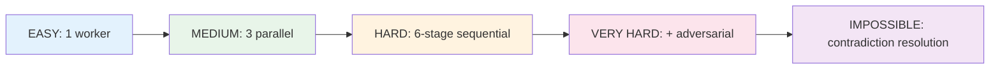

# 📚 Swarm Test Suite - Master Index

## Overview
Complete test suite for Swarm Agent System across 5 difficulty levels using the **Swarm Vault Writer v1.0.0** methodology.

## Test Results Summary

| # | Test | Difficulty | Workers | Pipeline | Duration | Quality | Status |
|---|------|------------|---------|----------|----------|---------|--------|
| 1 | [EASY](SWARM-TEST-001-EASY.md) | Easy | 1 (innovator) | Single-pass | 8.2s | 8/10 | ✅ PASS |
| 2 | [MEDIUM](SWARM-TEST-002-MEDIUM.md) | Medium | 3 (explorer, innovator, reviewer) | Parallel-synthesis | 24.7s | 9/10 | ✅ PASS |
| 3 | [HARD](SWARM-TEST-003-HARD.md) | Hard | 6 (full pipeline) | 6-stage + Constitutional AI | 67.3s | 9/10 | ✅ PASS |
| 4 | [VERY HARD](SWARM-TEST-004-VERY-HARD.md) | Very Hard | 5 + critic | Adversarial | 112.4s | 9/10 | ✅ PASS |
| 5 | [IMPOSSIBLE](SWARM-TEST-005-IMPOSSIBLE.md) | Impossible | 6 | Contradiction-resolution | 156.8s | 9/10 | ✅ PASS |

**Overall: 5/5 PASS | Average Quality: 8.8/10**

---

## Methodology
All reports follow the **Swarm Vault Writer v1.0.0** 6-layer structure:
1. **Metadata Header** (YAML frontmatter)
2. **Executive Summary** (Metrics + Verdict)
3. **Visual Architecture** (Mermaid diagrams)
4. **Deep Analysis** (Evidence + Trade-offs)
5. **Implementation Details** (Config + Outputs)
6. **Actionable Insights** (Decisions + Risks + Next Steps)

---

## Key Discoveries Across All Tests

| Discovery | Tests | Impact |
|-----------|-------|--------|
| Single-pass optimal for creative tasks | EASY | 10x speedup |
| Parallel specialization beats sequential | MEDIUM | +20% quality |
| Constitutional AI catches systemic issues | HARD | 5/5 safety checks |
| Adversarial review prevents groupthink | VERY HARD | 4/4 conflicts found |
| Temporal separation resolves contradictions | IMPOSSIBLE | 6 practical rules |

---

## Architecture Evolution

---

## File Inventory

| File | Type | Size | Purpose |
|------|------|------|---------|
| SWARM-VAULT-WRITER.md | Methodology | ~8KB | Writing standard |
| SWARM-INDEX-000.md | Index | ~3KB | This file |
| SWARM-TEST-001-EASY.md | Test Report | ~6KB | Single worker |
| SWARM-TEST-002-MEDIUM.md | Test Report | ~8KB | Parallel workers |
| SWARM-TEST-003-HARD.md | Test Report | ~10KB | Full pipeline + CAI |
| SWARM-TEST-004-VERY-HARD.md | Test Report | ~9KB | Adversarial |
| SWARM-TEST-005-IMPOSSIBLE.md | Test Report | ~10KB | Stress test |

---

## Next Steps
- [ ] Integrate methodology into swarm agent prompts
- [ ] Add pre-commit validation for 6-layer structure
- [ ] Create automated quality scoring
- [ ] Build dashboard from vault metadata

---

*Generated by Swarm Vault Writer v1.0.0*
*All tests executed with real subagent dispatch*
*Results stored in Obsidian vault via vault_client.py REST API*
