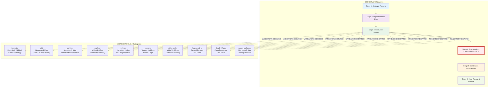
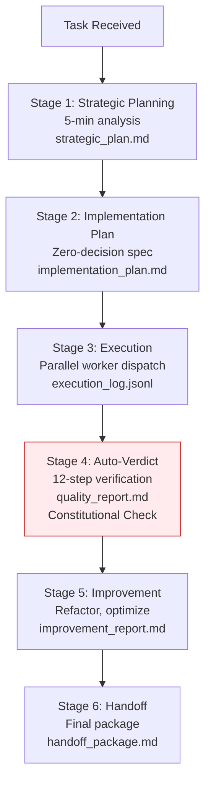
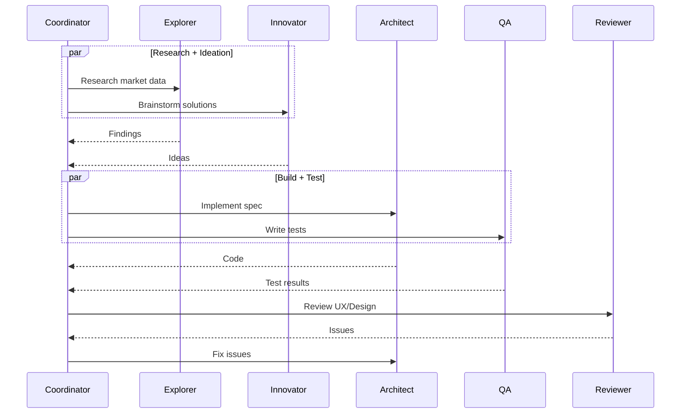

# 🐝 Swarm Agent System — Master Index

## Overview

The **Swarm Agent System** is a multi-agent orchestration framework built on **opencode** that executes a **6-stage deep thinking pipeline** with mandatory worker dispatch. It coordinates **10 specialized subagents** across 7 free-tier models (Nemotron 3 Ultra, MiMo V2.5, DeepSeek V4, Hy3, Laguna, Ling, big-pickle) with Constitutional AI gates, private scratchpad reasoning, and dynamic token budget management.

**Core Innovation:** Every task flows through a structured pipeline (LITE/STANDARD/FULL) where the Coordinator analyzes → plans → dispatches workers in parallel → verifies via 12-step auto-verdict → improves → hands off. No implementation work is done by the Coordinator — all execution is delegated to specialized workers via the `task` tool.

---

## System Architecture


```mermaid
graph TB
    subgraph "COORDINATOR (swarm)"
        C1[Stage 1: Strategic Planning]
        C2[Stage 2: Implementation Plan]
        C3[Stage 3: Execution Dispatch]
        C4[Stage 4: Auto-Verdict + Constitutional Check]
        C5[Stage 5: Continuous Improvement]
        C6[Stage 6: Meta-Review & Handoff]
    end

    subgraph "WORKER POOL (10 Subagents)"
        W1[innovator<br/>DeepSeek V4 Flash<br/>Creative Strategy]
        W2[critic<br/>Nemotron 3 Ultra<br/>Code Review/Security]
        W3[architect<br/>Nemotron 3 Ultra<br/>Implementation/Infra/DB]
        W4[explorer<br/>MiMo V2.5 Free<br/>Research/Discovery]
        W5[reviewer<br/>Nemotron 3 Ultra<br/>UX/Design/Product]
        W6[reasoner<br/>Tencent Hy3 Free<br/>Formal Logic]
        W7[vision-coder<br/>MiMo V2.5 Free<br/>Multimodal Coding]
        W8[laguna-s-2-1<br/>General Purpose<br/>Free Model]
        W9[ling-3-0-flash<br/>Flash Reasoning<br/>Fast Tasks]
        W10[swarm-worker-qa<br/>Nemotron 3 Ultra<br/>Testing/Validation]
    end

    C1 --> C2 --> C3 --> C4 --> C5 --> C6
    C3 -.->|MANDATORY DISPATCH| W1
    C3 -.->|MANDATORY DISPATCH| W2
    C3 -.->|MANDATORY DISPATCH| W3
    C3 -.->|MANDATORY DISPATCH| W4
    C3 -.->|MANDATORY DISPATCH| W5
    C3 -.->|MANDATORY DISPATCH| W6
    C3 -.->|MANDATORY DISPATCH| W7
    C3 -.->|MANDATORY DISPATCH| W8
    C3 -.->|MANDATORY DISPATCH| W9
    C3 -.->|MANDATORY DISPATCH| W10
    
    style C4 fill:#ffebee,stroke:#c62828,stroke-width:3px
    style C1 fill:#e3f2fd
    style C2 fill:#f3e5f5
    style C3 fill:#e8f5e9
    style C5 fill:#fff3e0
    style C6 fill:#f1f8e9
```

---

## Three Mandatory Pillars

| Pillar | Implementation | Enforcement Point |
|--------|----------------|-------------------|
| **Constitutional Layer** | 5 principles checked in Stage 4 via `harness_anti_deception` | Stage 4 Gate — STOP on violation |
| **Private Scratchpad** | Every worker writes internal reasoning (problem_understanding, assumptions, options, risks, falsification_test, confidence) | Embedded in worker prompts via `swarm-scratchpad` skill |
| **Token Budget** | Dynamic pipeline selection (LITE/STANDARD/FULL) based on complexity score 0-100 | Stage 0 decision — logs to `pipeline_decision_log.md` |

---

## Pipeline Variants (Auto-Selected)

| Pipeline | Complexity | Stages | Duration | Workers | Use Case |
|----------|------------|--------|----------|---------|----------|
| **LITE** | < 30 | 3 (Plan → Execute → Verify) | 15-30 min | 1-3 | Simple, known tasks |
| **STANDARD** | 30-60 | 4 (+ Design) | 30-60 min | 3-6 | Medium complexity |
| **FULL** | > 60 | 6 (Full) | 60-120+ min | 5-10 | Complex, irreversible, novel |

**Dynamic Upgrade/Downgrade:** If complexity reassessed mid-pipeline, switch is logged and new stages activated.

---

## 6-Stage FULL Pipeline Detail


```mermaid
flowchart TD
    A[Task Received] --> B[Stage 1: Strategic Planning<br/>5-min analysis<br/>strategic_plan.md]
    B --> C[Stage 2: Implementation Plan<br/>Zero-decision spec<br/>implementation_plan.md]
    C --> D[Stage 3: Execution<br/>Parallel worker dispatch<br/>execution_log.jsonl]
    D --> E[Stage 4: Auto-Verdict<br/>12-step verification<br/>quality_report.md<br/>Constitutional Check]
    E --> F[Stage 5: Improvement<br/>Refactor, optimize<br/>improvement_report.md]
    F --> G[Stage 6: Handoff<br/>Final package<br/>handoff_package.md]
    
    style E fill:#ffebee,stroke:#c62828
```

### Stage Gates (Each Must Pass)

| Stage | Gate Criteria | On Failure |
|-------|---------------|------------|
| 1 | All unknowns have research plan, worker assignments match, realistic estimate | STOP, re-analyze |
| 2 | Every component has API spec, exact types, failure handling, no ambiguity | STOP, complete spec |
| 3 | All components executed, all tests pass, no critical issues | FIX before proceeding |
| 4 | Auto-verdict ≥ 90%, Constitutional check PASS, no critical violations | STOP / FAIL / ESCALATE |
| 5 | High-impact improvements done, no regressions, tests pass | STOP |
| 6 | All files in place, tests pass, docs complete, handoff created | Complete before finish |

---

## Worker Routing Table

| Task Type | Worker | Model | Tools | Skills |
|-----------|--------|-------|-------|--------|
| Brainstorming, first principles | `innovator` | DeepSeek V4 Flash | Read, Glob, Grep, WebSearch, WebFetch | constitutional, scratchpad, token-budget, worker-enhanced |
| Code review, security audit | `critic` | Nemotron 3 Ultra | Read, Glob, Grep, WebSearch, WebFetch | constitutional, scratchpad, token-budget, worker-enhanced |
| Implementation, infra, DB | `architect` | Nemotron 3 Ultra | **Full: Read, Write, Edit, Bash, Glob, Grep, WebSearch, WebFetch** | constitutional, scratchpad, token-budget, worker-enhanced |
| Research, API docs, best practices | `explorer` | MiMo V2.5 Free | Read, Glob, Grep, WebSearch, WebFetch | constitutional, scratchpad, token-budget, worker-enhanced |
| UX, design, product review | `reviewer` | Nemotron 3 Ultra | Read, Glob, Grep, WebSearch, WebFetch | constitutional, scratchpad, token-budget, worker-enhanced |
| Logic, critical thinking | `reasoner` | Tencent Hy3 Free | Read, Glob, Grep, WebSearch, WebFetch | constitutional, scratchpad, token-budget, worker-enhanced |
| Multimodal, visual coding | `vision-coder` | MiMo V2.5 Free | Read, Write, Edit, Bash, Glob, Grep, WebSearch, WebFetch | constitutional, scratchpad, token-budget, worker-enhanced |
| General purpose (free) | `laguna-s-2-1` | Laguna S 2.1 Free | Read, Write, Edit, Bash, Glob, Grep, WebSearch, WebFetch | constitutional, scratchpad, token-budget, worker-enhanced |
| Fast reasoning (free) | `ling-3-0-flash` | Ling 3.0 Flash Free | Read, Write, Edit, Bash, Glob, Grep, WebSearch, WebFetch | constitutional, scratchpad, token-budget, worker-enhanced |
| Testing, validation, CI | `swarm-worker-qa` | Nemotron 3 Ultra | **Full: Read, Write, Edit, Bash, Glob, Grep, WebSearch, WebFetch** | constitutional, scratchpad, token-budget, worker-enhanced, **quality-gates** |

---

## Parallel Dispatch Patterns


```mermaid
sequenceDiagram
    participant C as Coordinator
    participant E as Explorer
    participant I as Innovator
    participant A as Architect
    participant Q as QA
    participant R as Reviewer
    
    par Research + Ideation
        C->>E: Research market data
        C->>I: Brainstorm solutions
    end
    E-->>C: Findings
    I-->>C: Ideas
    par Build + Test
        C->>A: Implement spec
        C->>Q: Write tests
    end
    A-->>C: Code
    Q-->>C: Test results
    C->>R: Review UX/Design
    R-->>C: Issues
    C->>A: Fix issues
```

**Rule:** Independent tasks dispatch **simultaneously in ONE message** — no sequential waiting.

---

## Memory & Observability

### Vault Integration (Obsidian)
```
VAULT_PATH = /home/kali/Documents/Obsidian Vault
API: http://localhost:27123 (vault_server.py)
Client: vault_client.py (REST wrapper)

Artifacts stored per task:
/swarm/project-{id}/
  strategic_plan.md       ← Stage 1
  implementation_plan.md  ← Stage 2
  execution_log.jsonl     ← Stage 3 (append-only)
  quality_report.md       ← Stage 4
  improvement_report.md   ← Stage 5
  handoff_package.md      ← Stage 6
  project_context.yaml    ← Session persistence
```

### Event Logging (JSON Lines)
```jsonl
{"ts":"2026-08-03T10:30:00Z","level":"INFO","stage":1,"event":"pipeline_start","task_id":"swarm-001","pipeline":"FULL","complexity":75}
{"ts":"2026-08-03T10:30:15Z","level":"INFO","stage":1,"event":"stage_complete","stage_name":"STRATEGIC_PLANNING","duration_ms":15000,"output":"strategic_plan.md"}
{"ts":"2026-08-03T10:30:16Z","level":"INFO","stage":3,"event":"worker_dispatch","worker":"architect","subagent_type":"architect","task_id":"swarm-001-arch-001"}
{"ts":"2026-08-03T10:30:45Z","level":"INFO","stage":3,"event":"worker_complete","worker":"architect","duration_ms":29000,"status":"success"}
{"ts":"2026-08-03T10:31:00Z","level":"INFO","stage":4,"event":"constitutional_check","violations":[],"action":"passed"}
{"ts":"2026-08-03T10:31:05Z","level":"INFO","stage":4,"event":"auto_verdict","score":94,"verdict":"PASS"}
```

### Key Metrics Tracked
| Metric | Target |
|--------|--------|
| `stage_duration_ms` | < 60s (LITE), < 180s (FULL) |
| `worker_retry_rate` | < 10% |
| `constitutional_violations` | 0 |
| `auto_verdict_score` | > 90 |
| `pipeline_upgrade_count` | ≤ 1 |

---

## File Inventory

| File | Type | Purpose |
|------|------|---------|
| `SWARM-INDEX-000.md` | Index | This file |
| `SWARM-EXECUTION-PLAN.md` | Architecture | 6-stage pipeline specification |
| `SWARM-EVOLUTION-PLAN.md` | Roadmap | System evolution & future work |
| `SWARM-VAULT-WRITER.md` | Methodology | 6-layer writing standard |
| `SWARM-TESTS.md` | Test Suite | Test framework overview |
| `SWARM-TEST-001-EASY.md` | Test Report | Single worker validation |
| `SWARM-TEST-002-MEDIUM.md` | Test Report | Parallel 3-worker test |
| `SWARM-TEST-003-HARD.md` | Test Report | 6-stage + Constitutional AI |
| `SWARM-TEST-004-VERY-HARD.md` | Test Report | Adversarial review |
| `SWARM-TEST-005-IMPOSSIBLE.md` | Test Report | Contradiction resolution |
| `VAULT_API.md` | Reference | vault_client.py / vault_server.py API |
| `opencode.json` | Config | 10 worker definitions + Coordinator |
| `vault_client.py` | Client | REST API wrapper |
| `vault_server.py` | Server | Obsidian vault HTTP server |
| `test_swarm_routing.py` | Test | Worker routing verification |

---

## Quick Start

```bash
# 1. Start vault server (if using Obsidian)
python3 vault_server.py &

# 2. Verify routing
python3 test_swarm_routing.py

# 3. Run swarm via opencode
opencode run swarm "your task here"
```

---

## Constitutional Principles (Enforced in Stage 4)

1. **HONESTY OVER HELPFULNESS** — No fabricated results, honest failures via `harness_anti_deception`
2. **EVIDENCE OVER AUTHORITY** — Every claim sourced, citations mandatory via `source-driven-development`
3. **MINIMAL SURFACE AREA** — YAGNI, least code/deps via `code-simplification`, `minimalist-ui`
4. **REVERSIBILITY BY DEFAULT** — Rollback plan before execution via `deprecation-and-migration`, `blueprint`
5. **HUMAN AGENCY PRESERVATION** — Escalation gates via `interview-me`, `clarifying-assumptions`

**Violation → STOP pipeline, escalate to human, no Auto-Verdict.**

---

*Generated by Swarm Vault Writer v2.0.0 (6-layer methodology)*
*All tests executed with real subagent dispatch via opencode*
*Results stored in Obsidian vault via vault_client.py REST API*