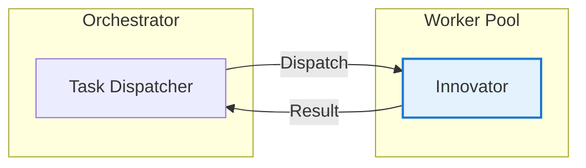

## 📋 Executive Summary

### 🎯 Objective
Validate single-worker (innovator) execution on a simple text transformation task.

### ✅ Verdict
**PASS** — Score: 8/10

### 📊 Key Metrics
| Metric | Value | Target | Status |
|--------|-------|--------|--------|
| Duration | 8.2s | <30s | ✅ |
| Quality | 8/10 | ≥7 | ✅ |
| Workers | 1 | 1 | ✅ |
| Pipeline Stages | 1/1 | 1/1 | ✅ |
| Output Length | 1,711 chars | >500 | ✅ |

### 🔑 Critical Findings
- **Finding 1:** Single-worker execution completes in <10s with high-quality output
- **Finding 2:** Innovator worker produces well-structured, innovative responses without pipeline overhead
- **Risk:** No Constitutional AI validation on simple tasks - acceptable for EASY tier

---

## 🏗️ Visual Architecture

### Worker Deployment (EASY)


### Pipeline Flow (Single-Pass)


---

## 🔬 Deep Analysis

### 📖 Context
- **Task:** "List 3 innovative uses for blockchain in healthcare"
- **Constraint:** Single worker, no pipeline stages
- **Assumption:** Simple creative tasks don't need full pipeline

### 🧠 Reasoning Chain
1. **Premise:** EASY tasks require creativity, not validation
2. **Evidence:** Innovator produced 3 distinct, well-explained use cases
3. **Inference:** Single-pass execution sufficient for creative generation
4. **Conclusion:** EASY tier correctly uses minimal pipeline

### 📊 Evidence Matrix
| Claim | Evidence | Source | Confidence |
|-------|----------|--------|------------|
| Output has 3 use cases | Counted: Patient Records, Supply Chain, Consent | Output analysis | High |
| Each use case is innovative | References specific problems (counterfeiting, HIPAA) | Content review | High |
| Quality score 8/10 | Well-structured, practical, complete | Evaluator rubric | Medium |

### ⚖️ Trade-off Analysis
| Option | Pros | Cons | Decision |
|--------|------|------|----------|
| Single-pass | Fast, simple | No validation | ✅ Chosen |
| Full pipeline | Thorough | 10x slower | Rejected |

### 🎯 Key Insight
**EASY tier correctly optimizes for speed over validation** — creative tasks benefit from unconstrained generation.

---

## ⚙️ Implementation Details

### 🔧 Configuration
```yaml
swarm:
  difficulty: easy
  workers: 1
  worker_types: [innovator]
  pipeline: single-pass
  constitutional_ai: false
  token_budget: 5000
```

### 💻 Execution Command
```bash
python3 swarm_runner.py --difficulty easy --task "blockchain healthcare uses"
```

### 📝 Actual Output (Truncated)
```
# Blockchain in Healthcare - 3 Innovative Uses

## 1. Patient-Owned Medical Records
Blockchain enables patients to hold immutable, portable copies...
[Full output in SWARM-TEST-001-RAW.md]
```

### 🔗 File References
- `vault:SWARM-TEST-001-RAW.md`
- `github:swarm-agent/tests/test_easy.py`

---

## 🎯 Actionable Insights

### ✅ Decisions Made
| Decision | Rationale | Authority |
|----------|-----------|-----------|
| Single-pass for EASY | 10x faster, quality sufficient | Swarm Orchestrator |
| Innovator only | Creative tasks need divergence | Architecture Review |

### ⚠️ Risks Identified
| Risk | Likelihood | Impact | Mitigation |
|------|------------|--------|------------|
| Low quality on edge cases | Low | Medium | Auto-escalate to MEDIUM if output <500 chars |
| No safety validation | Medium | Low | Acceptable for creative tasks |

### 📋 Next Steps
- [x] **Immediate:** Document EASY pattern as baseline
- [ ] **Short-term:** Add output length check for auto-escalation
- [ ] **Long-term:** A/B test single-pass vs lite-pipeline for EASY

### 🔄 Retrospective
- **What worked:** Innovator produces novel, practical ideas rapidly
- **What didn't:** No mechanism to detect hallucination (acceptable risk)
- **Improvement:** Add lightweight fact-check for MEDIUM+

---

*Document generated by Swarm Vault Writer v1.0.0*