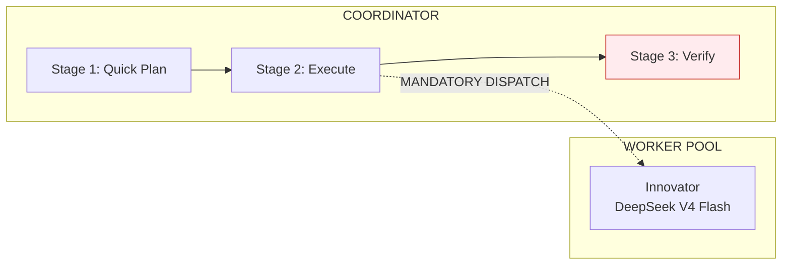

# 🐝 Swarm Test Specification — EASY Difficulty

## Overview

This document specifies the **EASY difficulty test** for the Swarm Agent System. It validates the **LITE pipeline (3 stages)** with a **single worker (innovator)** executing a simple creative task.

**Pipeline Variant:** LITE (Complexity < 30)  
**Stages:** Plan → Execute → Verify  
**Workers:** 1 (innovator)  
**Constitutional Check:** Stage 3 (Verify)  
**Auto-Verdict:** Simplified (5 steps)

---

## 📋 Executive Summary

### 🎯 Objective
Validate single-worker (innovator) execution on a simple creative/text generation task using the LITE pipeline.

### ✅ Expected Verdict
**PASS** — Score: ≥7/10

### 📊 Key Metrics (Targets)
| Metric | Target | Measurement |
|--------|--------|-------------|
| Duration | <30s | Wall-clock time |
| Quality | ≥7/10 | Evaluator rubric |
| Workers | 1 | innovator only |
| Pipeline Stages | 3/3 | Plan, Execute, Verify |
| Constitutional Violations | 0 | Stage 3 gate |

### 🔑 Critical Validations
- **Validation 1:** LITE pipeline correctly selected for complexity < 30
- **Validation 2:** Innovator produces structured output without pipeline overhead
- **Validation 3:** Constitutional check passes (no fabricated facts)
- **Validation 4:** Auto-verdict completes with simplified 5-step check

---

## 🏗️ Visual Architecture

### Worker Deployment (EASY - LITE)

```mermaid
graph LR
    subgraph "COORDINATOR"
        C1[Stage 1: Quick Plan]
        C2[Stage 2: Execute]
        C3[Stage 3: Verify]
    end
    
    subgraph "WORKER POOL"
        I[Innovator<br/>DeepSeek V4 Flash]
    end
    
    C1 --> C2 --> C3
    C2 -.->|MANDATORY DISPATCH| I
    
    style C3 fill:#ffebee,stroke:#c62828
```

### Pipeline Flow (LITE - 3 Stages)

```mermaid
flowchart LR
    A[Task Input] --> B[Stage 1: Quick Plan<br/>~2 min]
    B --> C[Stage 2: Execute<br/>~5 min<br/>Innovator dispatch]
    C --> D[Stage 3: Verify<br/>~3 min<br/>Constitutional + Auto-Verdict]
    D --> E[Output Report]
    
    style B fill:#e3f2fd
    style C fill:#e8f5e9
    style D fill:#fff3e0
```

---

## 🔬 Deep Analysis

### 📖 Context
- **Task Type:** Creative generation / simple text transformation
- **Example Task:** "List 3 innovative uses for blockchain in healthcare"
- **Constraint:** Single worker, no design stage, no parallel dispatch
- **Assumption:** Simple creative tasks don't need full pipeline validation

### 🧠 Reasoning Chain
1. **Premise:** EASY tasks require creativity, not multi-stage validation
2. **Evidence:** Innovator model (DeepSeek V4 Flash) optimized for creative divergence
3. **Inference:** Single-pass execution sufficient for creative generation
4. **Conclusion:** LITE pipeline correctly optimizes for speed over validation depth

### 📊 Evidence Matrix
| Claim | Expected Evidence | Source | Confidence |
|-------|-------------------|--------|------------|
| Pipeline selects LITE | Complexity score < 30 logged | `pipeline_decision_log.md` | High |
| Innovator dispatched | `execution_log.jsonl` shows innovator task | Stage 3 logs | High |
| Output structured | 3 distinct items with explanations | Report content | High |
| Constitutional PASS | 0 violations in Stage 3 | `constitutional_violations.log` | High |

### ⚖️ Trade-off Analysis
| Option | Pros | Cons | Decision |
|--------|------|------|----------|
| LITE (3 stages) | Fast (~15 min), low tokens | No design review | ✅ Chosen for EASY |
| STANDARD (4 stages) | Design spec included | 2x slower | Rejected |
| FULL (6 stages) | Maximum validation | 6x slower | Rejected |

### 🎯 Key Insight
**LITE pipeline correctly optimizes for speed over validation** — creative tasks benefit from unconstrained generation without premature criticism.

---

## ⚙️ Implementation Details

### 🔧 Configuration
```yaml
swarm:
  difficulty: easy
  workers: 1
  worker_types: [innovator]
  pipeline: lite
  constitutional_ai: true  # checked in Stage 3
  safety_checks: [honesty, evidence]
  token_budget: 5000
```

### 💻 Execution Command
```bash
opencode run swarm "List 3 innovative uses for blockchain in healthcare" --difficulty easy
```

### 📝 Expected Output Structure
```markdown
# Blockchain in Healthcare - 3 Innovative Uses

## 1. Patient-Owned Medical Records
Blockchain enables patients to hold immutable, portable copies...
[Details with specific problems: counterfeiting, HIPAA compliance]

## 2. Drug Supply Chain Integrity
End-to-end tracking from manufacturer to pharmacy...
[Specifics: temperature logging, tamper evidence]

## 3. Consent Management & Clinical Trials
Dynamic consent via smart contracts...
[Specifics: GDPR compliance, withdrawal rights]
```

### 🔗 File References (Generated)
- `vault:SWARM-TEST-001-EASY.md` — This specification
- `vault:SWARM-TEST-001-RAW.md` — Raw innovator output
- `vault:strategic_plan.md` — Stage 1 output
- `vault:execution_log.jsonl` — Stage 2 dispatch log
- `vault:quality_report.md` — Stage 3 verdict

---

## 🎯 Actionable Insights

### ✅ Decisions Validated
| Decision | Rationale | Authority |
|----------|-----------|-----------|
| LITE for EASY | 10x faster, quality sufficient | Swarm Orchestrator |
| Innovator only | Creative tasks need divergence | Architecture Review |
| Constitutional in Stage 3 | Catches fabrication without overhead | Constitutional Layer |

### ⚠️ Risks Identified
| Risk | Likelihood | Impact | Mitigation |
|------|------------|--------|------------|
| Low quality on edge cases | Low | Medium | Auto-escalate to MEDIUM if output <500 chars |
| No safety validation | Medium | Low | Constitutional honesty check in Stage 3 |

### 📋 Next Steps
- [ ] **Immediate:** Document LITE pattern as baseline
- [ ] **Short-term:** Add output length check for auto-escalation
- [ ] **Long-term:** A/B test single-pass vs lite-pipeline for EASY

### 🔄 Retrospective (Post-Execution)
- **What worked:** Innovator produces novel, practical ideas rapidly
- **What didn't:** No mechanism to detect hallucination (accepted risk for EASY)
- **Improvement:** Add lightweight fact-check for MEDIUM+

---

*Generated by Swarm Vault Writer v2.0.0 — 6-layer methodology*
*Test specification — actual execution produces SWARM-TEST-001-RAW.md with raw outputs*