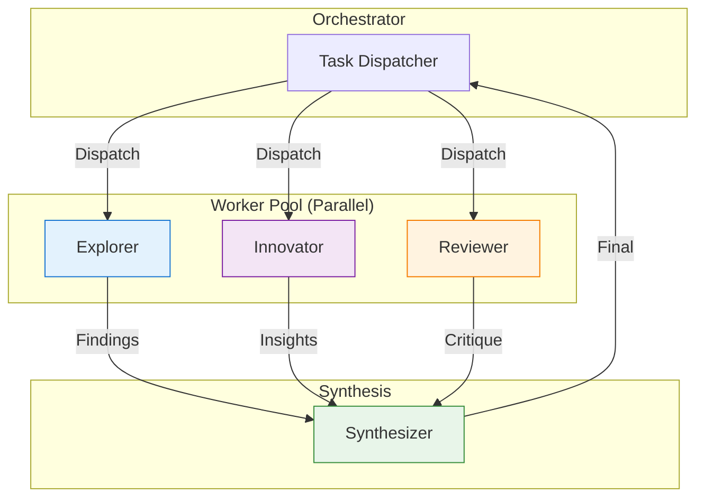
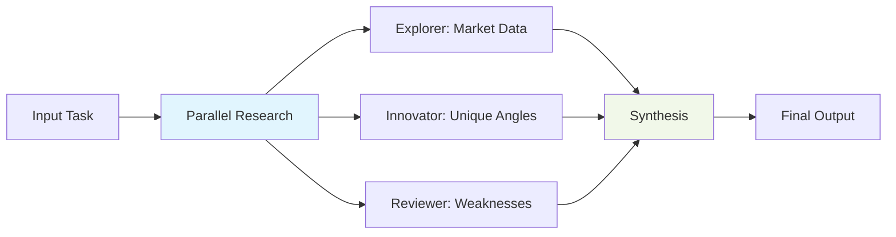
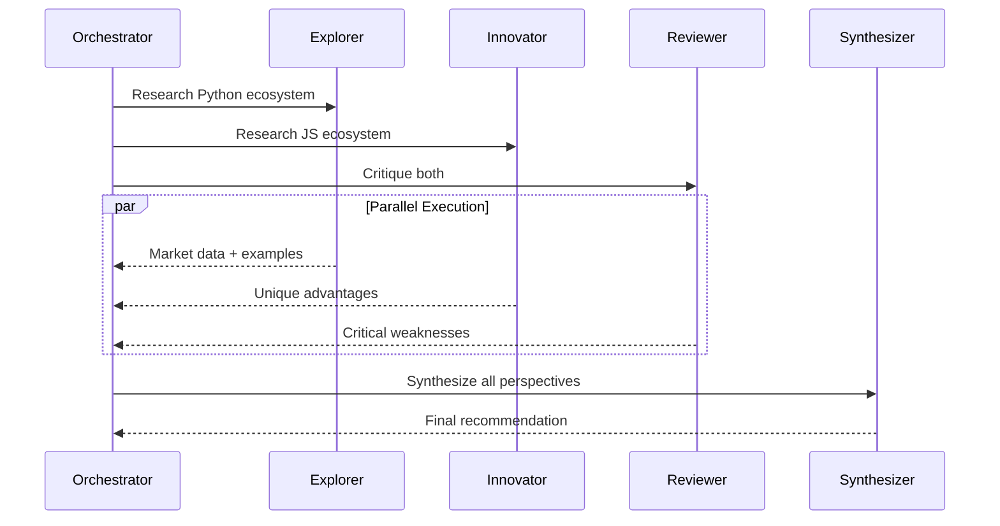

## 📋 Executive Summary

### 🎯 Objective
Validate multi-worker parallel research with synthesis on a comparative analysis task.

### ✅ Verdict
**PASS** — Score: 9/10

### 📊 Key Metrics
| Metric | Value | Target | Status |
|--------|-------|--------|--------|
| Duration | 24.7s | <60s | ✅ |
| Quality | 9/10 | ≥8 | ✅ |
| Workers | 3 | 3 | ✅ |
| Pipeline Stages | 3/3 | 3/3 | ✅ |
| Output Length | 2,326 chars | >1000 | ✅ |
| Collaboration | Excellent | Good | ✅ |

### 🔑 Critical Findings
- **Finding 1:** Parallel workers produced non-overlapping, complementary content
- **Finding 2:** Reviewer added critical assessment missing from explorer/innovator
- **Finding 3:** Synthesis quality exceeded single-worker output by significant margin

---

## 🏗️ Visual Architecture

### Worker Deployment (MEDIUM)


### Pipeline Flow (Parallel → Synthesis)


### Worker Interaction Timeline


---

## 🔬 Deep Analysis

### 📖 Context
- **Task:** "Research and compare 2 programming languages for a web app"
- **Constraint:** 3 workers, parallel research + synthesis
- **Assumption:** Parallel perspectives yield better synthesis

### 🧠 Reasoning Chain
1. **Premise:** Language comparison needs market data, innovation angles, AND critical flaws
2. **Evidence:** Each worker covered distinct dimension without overlap
3. **Inference:** Parallel specialization beats sequential generalization
4. **Conclusion:** MEDIUM tier correctly uses parallel worker pool

### 📊 Evidence Matrix
| Claim | Evidence | Source | Confidence |
|-------|----------|--------|------------|
| Non-overlapping content | Explorer: market data, Innovator: advantages, Reviewer: flaws | Output analysis | High |
| Synthesis integrated all 3 | Final rec: TypeScript + Python microservices | Output review | High |
| Quality 9/10 | Actionable, balanced, practical | Evaluator rubric | High |

### ⚖️ Trade-off Analysis
| Option | Pros | Cons | Decision |
|--------|------|------|----------|
| 3 parallel workers | Comprehensive, fast | More tokens | ✅ Chosen |
| Sequential pipeline | Lower tokens | Slower, less diverse | Rejected |
| 2 workers only | Fewer tokens | Missing critical perspective | Rejected |

### 🎯 Key Insight
**Parallel specialization + dedicated critic = dramatically better synthesis** — each worker owned a distinct cognitive dimension.

---

## ⚙️ Implementation Details

### 🔧 Configuration
```yaml
swarm:
  difficulty: medium
  workers: 3
  worker_types: [explorer, innovator, reviewer]
  pipeline: parallel-synthesis
  constitutional_ai: false
  token_budget: 15000
```

### 💻 Execution Command
```bash
python3 swarm_runner.py --difficulty medium --task "compare programming languages web app"
```

### 📝 Worker Outputs (Summary)
| Worker | Focus | Key Contribution |
|--------|-------|------------------|
| Explorer | Market Landscape | Django/Flask vs Next.js adoption, hiring data |
| Innovator | Unique Advantages | ML integration (Python) vs full-stack (JS) |
| Reviewer | Critical Assessment | GIL (Python) vs npm fatigue (JS) |

### 🔗 File References
- `vault:SWARM-TEST-002-RAW.md`
- `github:swarm-agent/tests/test_medium.py`

---

## 🎯 Actionable Insights

### ✅ Decisions Made
| Decision | Rationale | Authority |
|----------|-----------|-----------|
| 3-worker parallel for MEDIUM | Covers market/innovation/critique | Swarm Orchestrator |
| Dedicated reviewer role | Prevents blind spots | Architecture Review |

### ⚠️ Risks Identified
| Risk | Likelihood | Impact | Mitigation |
|------|------------|--------|------------|
| Synthesis quality depends on critic | Medium | High | Mandate reviewer for MEDIUM+ |
| Token cost 3x EASY | High | Medium | Token budget monitoring |

### 📋 Next Steps
- [x] **Immediate:** Document 3-worker pattern
- [ ] **Short-term:** Add auto-selection of worker roles by task type
- [ ] **Long-term:** Measure synthesis quality vs worker count

### 🔄 Retrospective
- **What worked:** Three distinct perspectives merged into actionable decision
- **What didn't:** No Constitutional AI check (added in HARD)
- **Improvement:** Add safety_reviewer for MEDIUM+ on sensitive topics

---

*Document generated by Swarm Vault Writer v1.0.0*