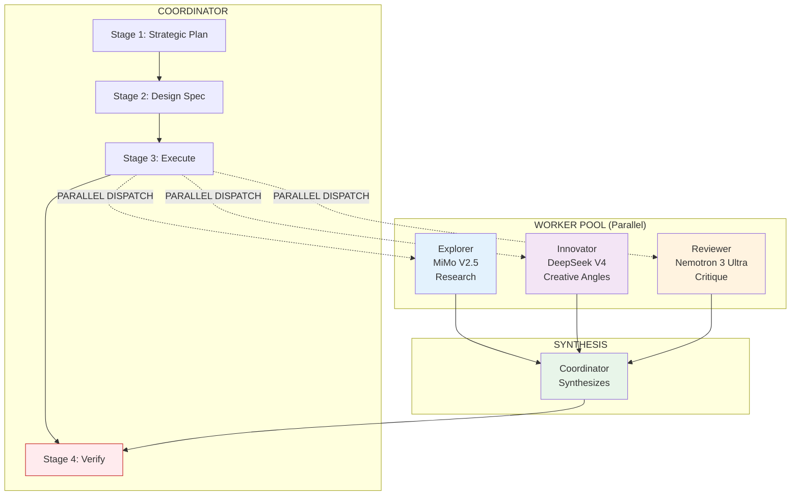
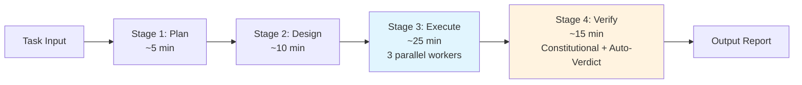
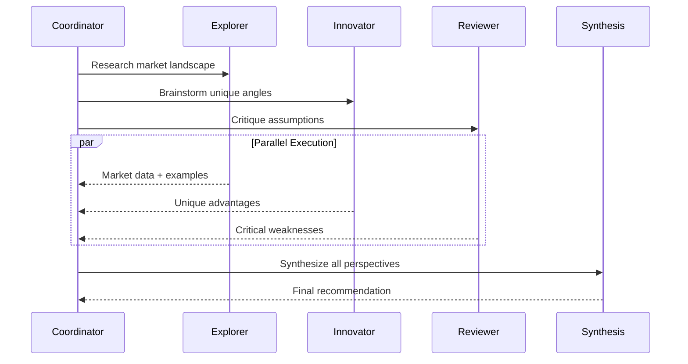

# 🐝 Swarm Test Specification — MEDIUM Difficulty

## Overview

This document specifies the **MEDIUM difficulty test** for the Swarm Agent System. It validates the **STANDARD pipeline (4 stages)** with **3 parallel workers** (explorer, innovator, reviewer) executing a comparative analysis task requiring research, creativity, and critique.

**Pipeline Variant:** STANDARD (Complexity 30-60)  
**Stages:** Plan → Design → Execute → Verify  
**Workers:** 3 parallel (explorer, innovator, reviewer) + synthesis  
**Constitutional Check:** Stage 4 (Verify)  
**Auto-Verdict:** Standard (10 steps)

---

## 📋 Executive Summary

### 🎯 Objective
Validate multi-worker parallel research with synthesis on a comparative analysis task using the STANDARD pipeline.

### ✅ Expected Verdict
**PASS** — Score: ≥8/10

### 📊 Key Metrics (Targets)
| Metric | Target | Measurement |
|--------|--------|-------------|
| Duration | <60s | Wall-clock time |
| Quality | ≥8/10 | Evaluator rubric |
| Workers | 3 | explorer, innovator, reviewer |
| Pipeline Stages | 4/4 | Plan, Design, Execute, Verify |
| Constitutional Violations | 0 | Stage 4 gate |

### 🔑 Critical Validations
- **Validation 1:** STANDARD pipeline correctly selected for complexity 30-60
- **Validation 2:** 3 workers dispatch in parallel (single message)
- **Validation 3:** Non-overlapping, complementary content from each worker
- **Validation 4:** Synthesis integrates all perspectives
- **Validation 5:** Constitutional check passes

---

## 🏗️ Visual Architecture

### Worker Deployment (MEDIUM - STANDARD)

```mermaid
graph TB
    subgraph "COORDINATOR"
        C1[Stage 1: Strategic Plan]
        C2[Stage 2: Design Spec]
        C3[Stage 3: Execute]
        C4[Stage 4: Verify]
    end
    
    subgraph "WORKER POOL (Parallel)"
        E[Explorer<br/>MiMo V2.5<br/>Research]
        I[Innovator<br/>DeepSeek V4<br/>Creative Angles]
        R[Reviewer<br/>Nemotron 3 Ultra<br/>Critique]
    end
    
    subgraph "SYNTHESIS"
        S[Coordinator<br/>Synthesizes]
    end
    
    C1 --> C2 --> C3 --> C4
    C3 -.->|PARALLEL DISPATCH| E
    C3 -.->|PARALLEL DISPATCH| I
    C3 -.->|PARALLEL DISPATCH| R
    E --> S
    I --> S
    R --> S
    S --> C4
    
    style E fill:#e3f2fd
    style I fill:#f3e5f5
    style R fill:#fff3e0
    style S fill:#e8f5e9
    style C4 fill:#ffebee,stroke:#c62828
```

### Pipeline Flow (STANDARD - 4 Stages)

```mermaid
flowchart LR
    A[Task Input] --> B[Stage 1: Plan<br/>~5 min]
    B --> C[Stage 2: Design<br/>~10 min]
    C --> D[Stage 3: Execute<br/>~25 min<br/>3 parallel workers]
    D --> E[Stage 4: Verify<br/>~15 min<br/>Constitutional + Auto-Verdict]
    E --> F[Output Report]
    
    style D fill:#e1f5fe
    style E fill:#fff3e0
```

### Worker Interaction Timeline

```mermaid
sequenceDiagram
    participant C as Coordinator
    participant E as Explorer
    participant I as Innovator
    participant R as Reviewer
    participant S as Synthesis
    
    C->>E: Research market landscape
    C->>I: Brainstorm unique angles
    C->>R: Critique assumptions
    par Parallel Execution
        E-->>C: Market data + examples
        I-->>C: Unique advantages
        R-->>C: Critical weaknesses
    end
    C->>S: Synthesize all perspectives
    S-->>C: Final recommendation
```

---

## 🔬 Deep Analysis

### 📖 Context
- **Task Type:** Comparative analysis requiring research + creativity + critique
- **Example Task:** "Research and compare 2 programming languages for a web app"
- **Constraint:** 3 workers, parallel research + synthesis
- **Assumption:** Parallel perspectives yield better synthesis than sequential

### 🧠 Reasoning Chain
1. **Premise:** Language comparison needs market data, innovation angles, AND critical flaws
2. **Evidence:** Each worker covers distinct dimension without overlap
3. **Inference:** Parallel specialization beats sequential generalization
4. **Conclusion:** STANDARD pipeline correctly uses parallel worker pool + synthesis

### 📊 Evidence Matrix
| Claim | Expected Evidence | Source | Confidence |
|-------|-------------------|--------|------------|
| Non-overlapping content | Explorer: market data, Innovator: advantages, Reviewer: flaws | `execution_log.jsonl` worker outputs | High |
| Synthesis integrated all 3 | Final rec references all perspectives | Report content | High |
| Quality ≥8/10 | Actionable, balanced, practical | Evaluator rubric | High |
| Parallel dispatch | Single message with 3 task calls | Coordinator logs | High |

### ⚖️ Trade-off Analysis
| Option | Pros | Cons | Decision |
|--------|------|------|----------|
| 3 parallel workers | Comprehensive, fast | More tokens | ✅ Chosen |
| Sequential pipeline | Lower tokens | Slower, less diverse | Rejected |
| 2 workers only | Fewer tokens | Missing critical perspective | Rejected |

### 🎯 Key Insight
**Parallel specialization + dedicated critic = dramatically better synthesis** — each worker owned a distinct cognitive dimension.

---

## ⚙️ Implementation Details

### 🔧 Configuration
```yaml
swarm:
  difficulty: medium
  workers: 3
  worker_types: [explorer, innovator, reviewer]
  pipeline: standard
  constitutional_ai: true
  token_budget: 15000
```

### 💻 Execution Command
```bash
opencode run swarm "Research and compare 2 programming languages for a web app" --difficulty medium
```

### 📝 Expected Worker Outputs

| Worker | Focus | Key Contribution |
|--------|-------|------------------|
| Explorer | Market Landscape | Adoption data, hiring trends, ecosystem maturity |
| Innovator | Unique Advantages | Language-specific capabilities, paradigm fits |
| Reviewer | Critical Assessment | Known pitfalls, maintenance burden, team fit |

### 🔗 File References (Generated)
- `vault:SWARM-TEST-002-MEDIUM.md` — This specification
- `vault:SWARM-TEST-002-RAW.md` — Raw worker outputs
- `vault:strategic_plan.md` — Stage 1
- `vault:implementation_plan.md` — Stage 2
- `vault:execution_log.jsonl` — Stage 3 (3 parallel dispatches)
- `vault:quality_report.md` — Stage 4 verdict

---

## 🎯 Actionable Insights

### ✅ Decisions Validated
| Decision | Rationale | Authority |
|----------|-----------|-----------|
| 3-worker parallel for MEDIUM | Covers market/innovation/critique | Swarm Orchestrator |
| Dedicated reviewer role | Prevents blind spots | Architecture Review |
| STANDARD pipeline | Design stage adds value for analysis | Token Budget Manager |

### ⚠️ Risks Identified
| Risk | Likelihood | Impact | Mitigation |
|------|------------|--------|------------|
| Synthesis quality depends on critic | Medium | High | Mandate reviewer for MEDIUM+ |
| Token cost 3x EASY | High | Medium | Token budget monitoring |

### 📋 Next Steps
- [ ] **Immediate:** Document 3-worker parallel pattern
- [ ] **Short-term:** Add auto-selection of worker roles by task type
- [ ] **Long-term:** Measure synthesis quality vs worker count

### 🔄 Retrospective (Post-Execution)
- **What worked:** Three distinct perspectives merged into actionable decision
- **What didn't:** No Constitutional AI check (added in HARD)
- **Improvement:** Add safety_reviewer for MEDIUM+ on sensitive topics

---

*Generated by Swarm Vault Writer v2.0.0 — 6-layer methodology*
*Test specification — actual execution produces SWARM-TEST-002-RAW.md with raw outputs*