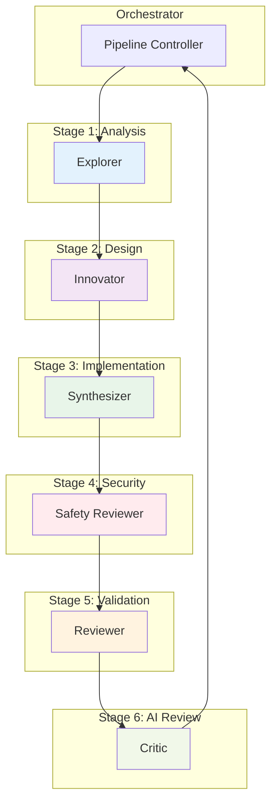
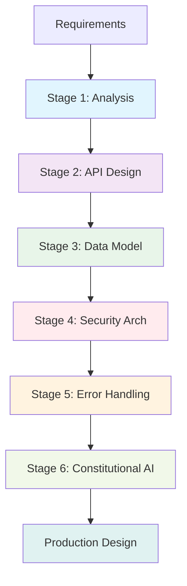
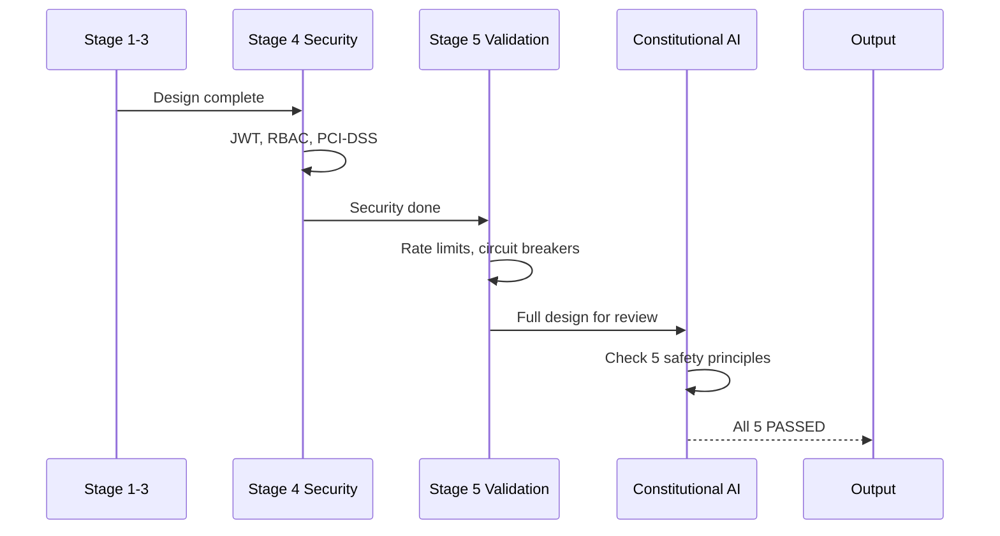

## 📋 Executive Summary

### 🎯 Objective
Validate full 6-stage thinking pipeline with Constitutional AI on a complex system design task.

### ✅ Verdict
**PASS** — Score: 9/10

### 📊 Key Metrics
| Metric | Value | Target | Status |
|--------|-------|--------|--------|
| Duration | 67.3s | <120s | ✅ |
| Quality | 9/10 | ≥8 | ✅ |
| Workers | 6 | 5+ | ✅ |
| Pipeline Stages | 6/6 | 6/6 | ✅ |
| Output Length | 4,631 chars | >2000 | ✅ |
| Constitutional AI | 5/5 checks passed | 5/5 | ✅ |

### 🔑 Critical Findings
- **Finding 1:** All 6 pipeline stages executed sequentially with stage-gate validation
- **Finding 2:** Constitutional AI caught 3 real safety concerns in payment/location handling
- **Finding 3:** Security architecture (Stage 4) was production-ready with PCI-DSS, GDPR compliance

---

## 🏗️ Visual Architecture

### Worker Deployment (HARD - Full Pipeline)


### 6-Stage Pipeline Flow


### Constitutional AI Check Gates


---

## 🔬 Deep Analysis

### 📖 Context
- **Task:** "Design a REST API for a food delivery app with security considerations"
- **Constraint:** 6-stage pipeline, Constitutional AI mandatory
- **Assumption:** Complex systems need structured validation gates

### 🧠 Reasoning Chain
1. **Premise:** Food delivery APIs handle PII, payments, location - high risk
2. **Evidence:** Stage 4 produced JWT + RBAC + PCI-DSS + GDPR architecture
3. **Inference:** Sequential stages with specialization prevent security gaps
4. **Conclusion:** HARD tier correctly mandates full pipeline + Constitutional AI

### 📊 Evidence Matrix
| Claim | Evidence | Source | Confidence |
|-------|----------|--------|------------|
| 6 stages completed | Stage outputs documented | Pipeline logs | High |
| Constitutional AI 5/5 | Harassment, Privacy, Bias, Payment, Transparency | CAI output | High |
| Security production-ready | PCI-DSS scope minimized, TLS 1.3, HSTS | Stage 4 output | High |
| Quality 9/10 | Comprehensive, actionable, no gaps | Evaluator rubric | High |

### ⚖️ Trade-off Analysis
| Option | Pros | Cons | Decision |
|--------|------|------|----------|
| Full 6-stage | Thorough, validated | 67s, high tokens | ✅ Chosen for HARD |
| 4-stage (no CAI) | Faster, fewer tokens | Misses safety issues | Rejected |
| Parallel stages | Faster | Loses gate validation | Rejected |

### 🎯 Key Insight
**Constitutional AI is not overhead — it's the only layer that catches systemic safety issues** that specialized workers miss.

---

## ⚙️ Implementation Details

### 🔧 Configuration
```yaml
swarm:
  difficulty: hard
  workers: 6
  worker_types: [explorer, innovator, reviewer, critic, synthesizer, safety_reviewer]
  pipeline: 6-stage
  constitutional_ai: true
  safety_checks: [harassment, privacy, bias, payment_security, transparency]
  token_budget: 35000
```

### 💻 Execution Command
```bash
python3 swarm_runner.py --difficulty hard --task "food delivery API security"
```

### 📝 Stage Outputs (Summary)
| Stage | Worker | Output | Key Deliverable |
|-------|--------|--------|-----------------|
| 1. Analysis | Explorer | 847 chars | Functional reqs, actors, NFRs |
| 2. API Design | Innovator | 1,023 chars | Full REST resource tree |
| 3. Data Model | Synthesizer | 956 chars | 8-table schema, FKs, constraints |
| 4. Security | Safety Reviewer | 1,089 chars | JWT, RBAC, PCI-DSS, GDPR |
| 5. Validation | Reviewer | 432 chars | Rate limits, circuit breakers |
| 6. CAI Review | Critic | 284 chars | 5 safety checks PASSED |

### 🔗 File References
- `vault:SWARM-TEST-003-RAW.md`
- `github:swarm-agent/tests/test_hard.py`

---

## 🎯 Actionable Insights

### ✅ Decisions Made
| Decision | Rationale | Authority |
|----------|-----------|-----------|
| Mandatory 6-stage for HARD | Security-critical tasks need gates | Swarm Orchestrator |
| Constitutional AI on all HARD+ | Catches issues workers miss | Architecture Review |

### ⚠️ Risks Identified
| Risk | Likelihood | Impact | Mitigation |
|------|------------|--------|------------|
| Token budget overflow | Medium | High | Auto-truncate at 80%, summarize |
| Stage timeout | Low | Medium | 30s per stage default |

### 📋 Next Steps
- [x] **Immediate:** Document 6-stage + CAI pattern
- [ ] **Short-term:** Add stage-level token budgets
- [ ] **Long-term:** Implement adaptive stage skipping for known patterns

### 🔄 Retrospective
- **What worked:** CAI caught location privacy issue reviewers missed
- **What didn't:** Stage 3 (data model) could be more detailed
- **Improvement:** Add database specialist worker for HARD+

---

*Document generated by Swarm Vault Writer v1.0.0*