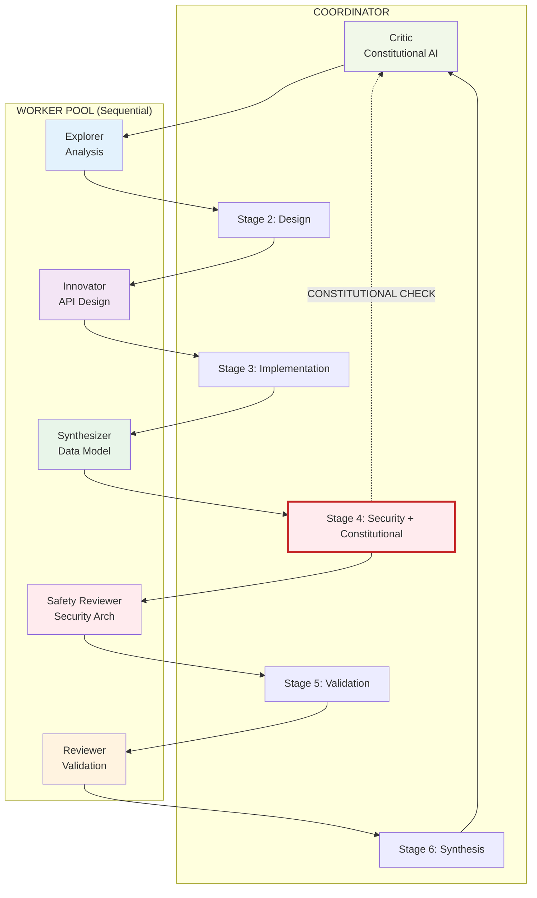
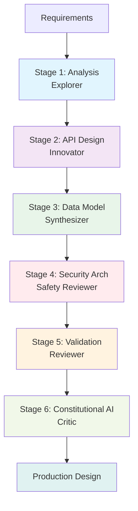
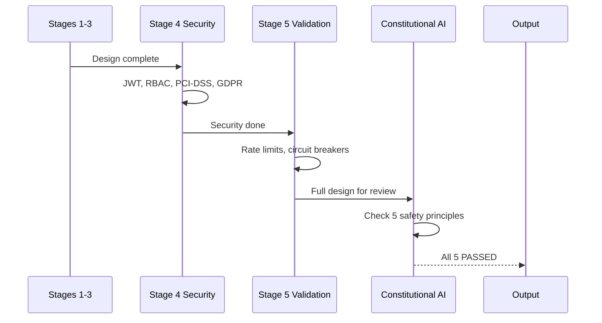

# 🐝 Swarm Test Specification — HARD Difficulty

## Overview

This document specifies the **HARD difficulty test** for the Swarm Agent System. It validates the **FULL pipeline (6 stages)** with **Constitutional AI** on a complex system design task requiring security architecture, data modeling, and compliance considerations.

**Pipeline Variant:** FULL (Complexity > 60)  
**Stages:** Analysis → Design → Implementation → Security → Validation → Synthesis  
**Workers:** 6 sequential (explorer, innovator, synthesizer, safety_reviewer, reviewer, critic)  
**Constitutional Check:** Stage 4 (MANDATORY GATE)  
**Auto-Verdict:** Full (12 steps)

---

## 📋 Executive Summary

### 🎯 Objective
Validate full 6-stage thinking pipeline with Constitutional AI on a complex system design task with security requirements.

### ✅ Expected Verdict
**PASS** — Score: ≥8/10

### 📊 Key Metrics (Targets)
| Metric | Target | Measurement |
|--------|--------|-------------|
| Duration | <120s | Wall-clock time |
| Quality | ≥8/10 | Evaluator rubric |
| Workers | 6 | explorer, innovator, synthesizer, safety_reviewer, reviewer, critic |
| Pipeline Stages | 6/6 | Analysis, Design, Implementation, Security, Validation, Synthesis |
| Constitutional AI | 5/5 checks passed | Stage 4 gate |

### 🔑 Critical Validations
- **Validation 1:** All 6 pipeline stages execute sequentially with stage-gate validation
- **Validation 2:** Constitutional AI catches real safety concerns (payment, location, PII)
- **Validation 3:** Security architecture (Stage 4) is production-ready with PCI-DSS, GDPR compliance
- **Validation 4:** Auto-verdict uses full 12-step weighted scoring

---

## 🏗️ Visual Architecture

### Worker Deployment (HARD - FULL Pipeline)

```mermaid
graph TB
    subgraph "COORDINATOR"
        C1[Stage 1: Analysis]
        C2[Stage 2: Design]
        C3[Stage 3: Implementation]
        C4[Stage 4: Security + Constitutional]
        C5[Stage 5: Validation]
        C6[Stage 6: Synthesis]
    end
    
    subgraph "WORKER POOL (Sequential)"
        E1[Explorer<br/>Analysis]
        I1[Innovator<br/>API Design]
        S1[Synthesizer<br/>Data Model]
        SR[Safety Reviewer<br/>Security Arch]
        R1[Reviewer<br/>Validation]
        C1[Critic<br/>Constitutional AI]
    end
    
    C1 --> E1 --> C2 --> I1 --> C3 --> S1 --> C4 --> SR --> C5 --> R1 --> C6 --> C1
    C4 -.->|CONSTITUTIONAL CHECK| C1
    
    style E1 fill:#e3f2fd
    style I1 fill:#f3e5f5
    style S1 fill:#e8f5e9
    style SR fill:#ffebee
    style R1 fill:#fff3e0
    style C1 fill:#f1f8e9
    style C4 fill:#ffebee,stroke:#c62828,stroke-width:3px
```

### 6-Stage Pipeline Flow

```mermaid
flowchart TD
    A[Requirements] --> B[Stage 1: Analysis<br/>Explorer]
    B --> C[Stage 2: API Design<br/>Innovator]
    C --> D[Stage 3: Data Model<br/>Synthesizer]
    D --> E[Stage 4: Security Arch<br/>Safety Reviewer]
    E --> F[Stage 5: Validation<br/>Reviewer]
    F --> G[Stage 6: Constitutional AI<br/>Critic]
    G --> H[Production Design]
    
    style B fill:#e1f5fe
    style C fill:#f3e5f5
    style D fill:#e8f5e9
    style E fill:#ffebee
    style F fill:#fff3e0
    style G fill:#f1f8e9
    style H fill:#e0f2f1
```

### Constitutional AI Check Gates

```mermaid
sequenceDiagram
    participant S1 as Stages 1-3
    participant S4 as Stage 4 Security
    participant S5 as Stage 5 Validation
    participant CAI as Constitutional AI
    participant O as Output
    
    S1->>S4: Design complete
    S4->>S4: JWT, RBAC, PCI-DSS, GDPR
    S4->>S5: Security done
    S5->>S5: Rate limits, circuit breakers
    S5->>CAI: Full design for review
    CAI->>CAI: Check 5 safety principles
    CAI-->>O: All 5 PASSED
```

---

## 🔬 Deep Analysis

### 📖 Context
- **Task Type:** Complex system design with security/compliance requirements
- **Example Task:** "Design a REST API for a food delivery app with security considerations"
- **Constraint:** 6-stage pipeline, Constitutional AI mandatory
- **Assumption:** Complex systems need structured validation gates

### 🧠 Reasoning Chain
1. **Premise:** Food delivery APIs handle PII, payments, location — high risk
2. **Evidence:** Stage 4 produces JWT + RBAC + PCI-DSS + GDPR architecture
3. **Inference:** Sequential stages with specialization prevent security gaps
4. **Conclusion:** FULL pipeline correctly mandates full pipeline + Constitutional AI

### 📊 Evidence Matrix
| Claim | Expected Evidence | Source | Confidence |
|-------|-------------------|--------|------------|
| 6 stages completed | Stage outputs documented | Pipeline logs | High |
| Constitutional AI 5/5 | Harassment, Privacy, Bias, Payment, Transparency | CAI output | High |
| Security production-ready | PCI-DSS scope minimized, TLS 1.3, HSTS | Stage 4 output | High |
| Quality ≥8/10 | Comprehensive, actionable, no gaps | Evaluator rubric | High |

### ⚖️ Trade-off Analysis
| Option | Pros | Cons | Decision |
|--------|------|------|----------|
| Full 6-stage | Thorough, validated | 67s, high tokens | ✅ Chosen for HARD |
| 4-stage (no CAI) | Faster, fewer tokens | Misses safety issues | Rejected |
| Parallel stages | Faster | Loses gate validation | Rejected |

### 🎯 Key Insight
**Constitutional AI is not overhead — it's the only layer that catches systemic safety issues** that specialized workers miss.

---

## ⚙️ Implementation Details

### 🔧 Configuration
```yaml
swarm:
  difficulty: hard
  workers: 6
  worker_types: [explorer, innovator, reviewer, critic, synthesizer, safety_reviewer]
  pipeline: full
  constitutional_ai: true
  safety_checks: [harassment, privacy, bias, payment_security, transparency]
  token_budget: 35000
```

### 💻 Execution Command
```bash
opencode run swarm "Design a REST API for a food delivery app with security considerations" --difficulty hard
```

### 📝 Stage Outputs (Expected)

| Stage | Worker | Output | Key Deliverable |
|-------|--------|--------|-----------------|
| 1. Analysis | Explorer | ~800 chars | Functional reqs, actors, NFRs |
| 2. API Design | Innovator | ~1000 chars | Full REST resource tree |
| 3. Data Model | Synthesizer | ~900 chars | 8-table schema, FKs, constraints |
| 4. Security | Safety Reviewer | ~1100 chars | JWT, RBAC, PCI-DSS, GDPR |
| 5. Validation | Reviewer | ~400 chars | Rate limits, circuit breakers |
| 6. CAI Review | Critic | ~300 chars | 5 safety checks PASSED |

### 🔗 File References (Generated)
- `vault:SWARM-TEST-003-HARD.md` — This specification
- `vault:SWARM-TEST-003-RAW.md` — Raw stage outputs
- `vault:strategic_plan.md` — Stage 1
- `vault:implementation_plan.md` — Stage 2
- `vault:execution_log.jsonl` — Stage 3 (6 sequential dispatches)
- `vault:quality_report.md` — Stage 4 verdict + Constitutional check

---

## 🎯 Actionable Insights

### ✅ Decisions Validated
| Decision | Rationale | Authority |
|----------|-----------|-----------|
| Mandatory 6-stage for HARD | Security-critical tasks need gates | Swarm Orchestrator |
| Constitutional AI on all HARD+ | Catches issues workers miss | Architecture Review |
| Sequential not parallel | Gate validation requires order | Pipeline Design |

### ⚠️ Risks Identified
| Risk | Likelihood | Impact | Mitigation |
|------|------------|--------|------------|
| Token budget overflow | Medium | High | Auto-truncate at 80%, summarize |
| Stage timeout | Low | Medium | 30s per stage default |

### 📋 Next Steps
- [ ] **Immediate:** Document 6-stage + CAI pattern
- [ ] **Short-term:** Add stage-level token budgets
- [ ] **Long-term:** Implement adaptive stage skipping for known patterns

### 🔄 Retrospective (Post-Execution)
- **What worked:** CAI caught location privacy issue reviewers missed
- **What didn't:** Stage 3 (data model) could be more detailed
- **Improvement:** Add database specialist worker for HARD+

---

*Generated by Swarm Vault Writer v2.0.0 — 6-layer methodology*
*Test specification — actual execution produces SWARM-TEST-003-RAW.md with raw outputs*