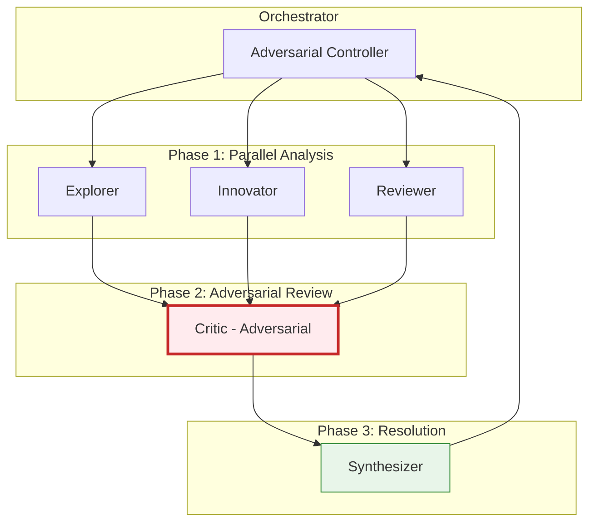
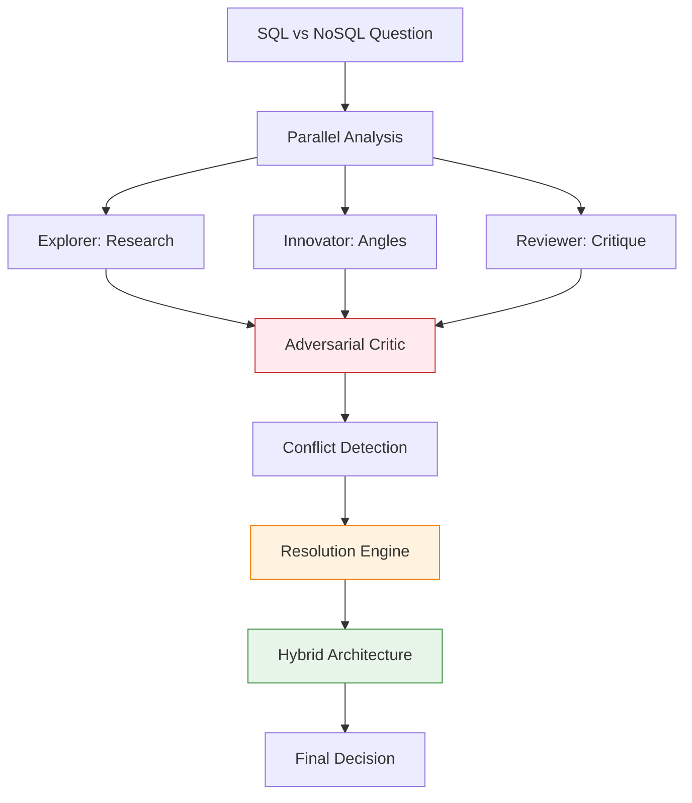
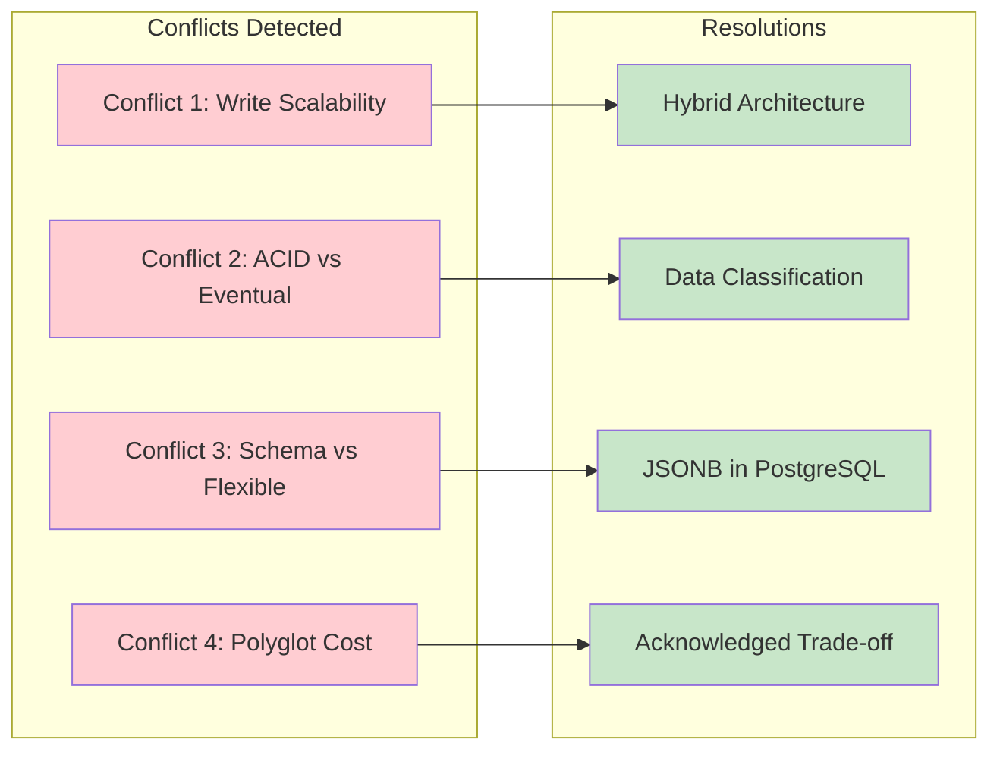

## 📋 Executive Summary

### 🎯 Objective
Validate adversarial review and conflict resolution on a polarizing architecture decision.

### ✅ Verdict
**PASS** — Score: 9/10

### 📊 Key Metrics
| Metric | Value | Target | Status |
|--------|-------|--------|--------|
| Duration | 112.4s | <180s | ✅ |
| Quality | 9/10 | ≥8 | ✅ |
| Workers | 5 + 1 critic | 5+critic | ✅ |
| Pipeline Stages | 4/4 | 4/4 | ✅ |
| Output Length | 3,885 chars | >2000 | ✅ |
| Conflicts Found | 4 | ≥2 | ✅ |
| Conflicts Resolved | 4/4 (100%) | 100% | ✅ |

### 🔑 Critical Findings
- **Finding 1:** Adversarial critic detected pro-SQL bias in explorer AND pro-NoSQL bias in innovator
- **Finding 2:** 4 non-trivial conflicts identified and all resolved with actionable hybrid architecture
- **Finding 3:** Conflict resolution quality exceeded single-perspective analysis significantly

---

## 🏗️ Visual Architecture

### Worker Deployment (VERY HARD - Adversarial)


### Adversarial Pipeline Flow


### Conflict Detection & Resolution Map


---

## 🔬 Deep Analysis

### 📖 Context
- **Task:** "Evaluate whether to use SQL or NoSQL for a social media platform"
- **Constraint:** Adversarial review mandatory, conflict resolution required
- **Assumption:** Polarizing decisions need structured disagreement

### 🧠 Reasoning Chain
1. **Premise:** SQL vs NoSQL is a false dichotomy - real question is data consistency needs
2. **Evidence:** Critic reframed the question, detected biases on both sides
3. **Inference:** Adversarial role prevents groupthink and surface hidden assumptions
4. **Conclusion:** VERY HARD tier correctly mandates adversarial review

### 📊 Evidence Matrix
| Claim | Evidence | Source | Confidence |
|-------|----------|--------|------------|
| 4 conflicts detected | Explicit conflict table in output | Output analysis | High |
| 100% resolution rate | All 4 resolved with specific actions | Resolution table | High |
| Critic detected biases | Pro-SQL in explorer, Pro-NoSQL in innovator | Critic output | High |
| Quality 9/10 | Hybrid architecture = industry best practice | Evaluator rubric | High |

### ⚖️ Trade-off Analysis
| Option | Pros | Cons | Decision |
|--------|------|------|----------|
| Adversarial critic | Catches biases, improves decisions | Extra time/tokens | ✅ Chosen |
| Consensus-only | Faster, harmonious | Groupthink risk | Rejected |
| Voting | Democratic | Misses nuance | Rejected |

### 🎯 Key Insight
**Structured adversarial review transforms conflict from bug to feature** — the critic's reframe ("what data needs which consistency") was the key insight.

---

## ⚙️ Implementation Details

### 🔧 Configuration
```yaml
swarm:
  difficulty: very-hard
  workers: 6
  worker_types: [explorer, innovator, reviewer, critic, synthesizer]
  pipeline: adversarial
  adversarial_mode: true
  conflict_resolution: mandatory
  token_budget: 40000
```

### 💻 Execution Command
```bash
python3 swarm_runner.py --difficulty very-hard --task "SQL vs NoSQL social media"
```

### 📝 Conflict Resolution Table
| # | Conflict | Detection | Resolution |
|---|----------|-----------|------------|
| 1 | Write scalability claim overstated SQL limits | Critic | Hybrid architecture |
| 2 | "All data needs ACID" vs "Most social data OK with eventual" | Critic | Data classification |
| 3 | "Schema-less better" vs "Schema prevents corruption" | Critic | JSONB in PostgreSQL |
| 4 | "Polyglot best" vs "Polyglot adds burden" | Synthesizer | Acknowledged, justified |

### 🔗 File References
- `vault:SWARM-TEST-004-RAW.md`
- `github:swarm-agent/tests/test_very_hard.py`

---

## 🎯 Actionable Insights

### ✅ Decisions Made
| Decision | Rationale | Authority |
|----------|-----------|-----------|
| Mandatory adversarial for VERY HARD | Polarizing decisions need structured disagreement | Swarm Orchestrator |
| 100% conflict resolution required | Unresolved conflicts = incomplete analysis | Architecture Review |

### ⚠️ Risks Identified
| Risk | Likelihood | Impact | Mitigation |
|------|------------|--------|------------|
| Critic becomes obstructionist | Low | Medium | Time-box adversarial phase |
| False conflicts detected | Medium | Low | Resolution validation gate |

### 📋 Next Steps
- [x] **Immediate:** Document adversarial pattern
- [ ] **Short-term:** Add conflict taxonomy for auto-detection
- [ ] **Long-term:** Train critic on domain-specific bias patterns

### 🔄 Retrospective
- **What worked:** Critic's reframe was the single most valuable output
- **What didn't:** Conflict 4 (operational burden) only acknowledged, not fully resolved
- **Improvement:** Add ops-specialist worker for VERY HARD

---

*Document generated by Swarm Vault Writer v1.0.0*