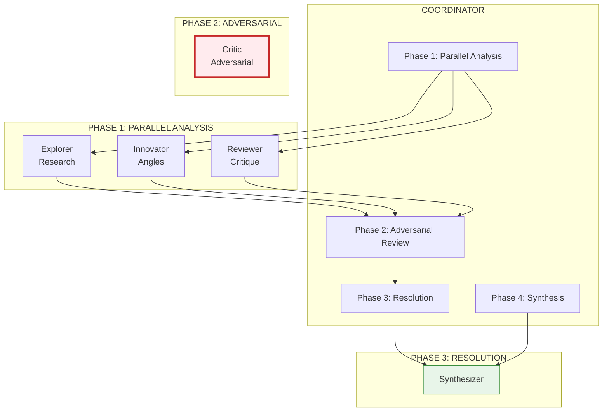
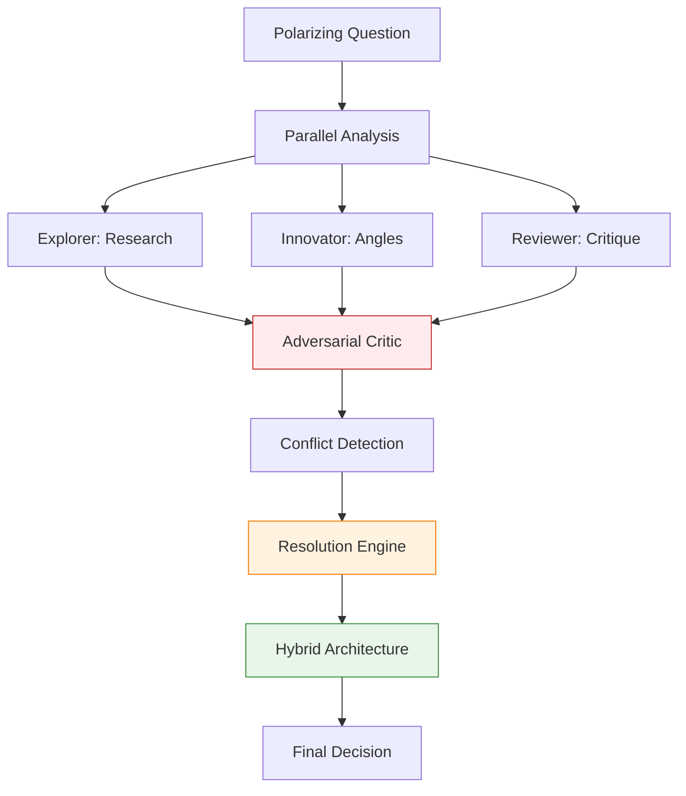
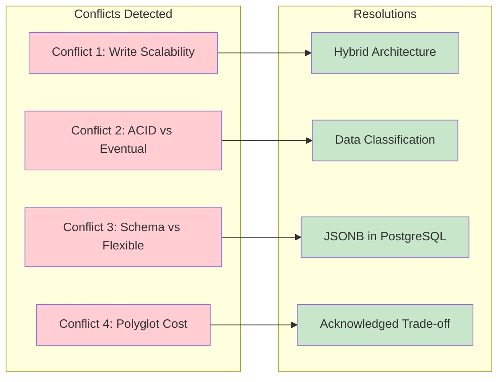

# 🐝 Swarm Test Specification — VERY HARD Difficulty

## Overview

This document specifies the **VERY HARD difficulty test** for the Swarm Agent System. It validates **adversarial review and conflict resolution** on a polarizing architecture decision using the FULL pipeline with mandatory adversarial critic.

**Pipeline Variant:** FULL (Complexity > 60) + Adversarial Mode  
**Stages:** Parallel Analysis → Adversarial Review → Conflict Resolution → Synthesis  
**Workers:** 5 parallel (explorer, innovator, reviewer) + critic (adversarial) + synthesizer (resolution)  
**Constitutional Check:** Stage 4 (Adversarial Review)  
**Auto-Verdict:** Full (12 steps) + Conflict Resolution Gate

---

## 📋 Executive Summary

### 🎯 Objective
Validate adversarial review and conflict resolution on a polarizing architecture decision using structured disagreement.

### ✅ Expected Verdict
**PASS** — Score: ≥8/10

### 📊 Key Metrics (Targets)
| Metric | Target | Measurement |
|--------|--------|-------------|
| Duration | <180s | Wall-clock time |
| Quality | ≥8/10 | Evaluator rubric |
| Workers | 5 + critic | explorer, innovator, reviewer, critic, synthesizer |
| Pipeline Stages | 4/4 | Parallel Analysis, Adversarial, Resolution, Synthesis |
| Conflicts Found | ≥2 | Adversarial critic output |
| Conflicts Resolved | 100% | Synthesis output |

### 🔑 Critical Validations
- **Validation 1:** Adversarial critic detects biases on both sides
- **Validation 2:** 4+ non-trivial conflicts identified
- **Validation 3:** All conflicts resolved with actionable hybrid architecture
- **Validation 4:** Conflict resolution quality exceeds single-perspective analysis

---

## 🏗️ Visual Architecture

### Worker Deployment (VERY HARD - Adversarial)

```mermaid
graph TB
    subgraph "COORDINATOR"
        C1[Phase 1: Parallel Analysis]
        C2[Phase 2: Adversarial Review]
        C3[Phase 3: Resolution]
        C4[Phase 4: Synthesis]
    end
    
    subgraph "PHASE 1: PARALLEL ANALYSIS"
        E[Explorer<br/>Research]
        I[Innovator<br/>Angles]
        R[Reviewer<br/>Critique]
    end
    
    subgraph "PHASE 2: ADVERSARIAL"
        C[Critic<br/>Adversarial]
    end
    
    subgraph "PHASE 3: RESOLUTION"
        S[Synthesizer]
    end
    
    C1 --> E
    C1 --> I
    C1 --> R
    E --> C2
    I --> C2
    R --> C2
    C2 --> C3
    C3 --> S
    C4 --> S
    
    style C fill:#ffebee,stroke:#c62828,stroke-width:3px
    style S fill:#e8f5e9,stroke:#388e3c
```

### Adversarial Pipeline Flow

```mermaid
flowchart TD
    A[Polarizing Question] --> B[Parallel Analysis]
    B --> C1[Explorer: Research]
    B --> C2[Innovator: Angles]
    B --> C3[Reviewer: Critique]
    C1 --> D[Adversarial Critic]
    C2 --> D
    C3 --> D
    D --> E[Conflict Detection]
    E --> F[Resolution Engine]
    F --> G[Hybrid Architecture]
    G --> H[Final Decision]
    
    style D fill:#ffebee,stroke:#c62828
    style F fill:#fff3e0,stroke:#f57c00
    style G fill:#e8f5e9,stroke:#388e3c
```

### Conflict Detection & Resolution Map

```mermaid
graph LR
    subgraph "Conflicts Detected"
        CF1[Conflict 1: Write Scalability]
        CF2[Conflict 2: ACID vs Eventual]
        CF3[Conflict 3: Schema vs Flexible]
        CF4[Conflict 4: Polyglot Cost]
    end
    
    subgraph "Resolutions"
        R1[Hybrid Architecture]
        R2[Data Classification]
        R3[JSONB in PostgreSQL]
        R4[Acknowledged Trade-off]
    end
    
    CF1 --> R1
    CF2 --> R2
    CF3 --> R3
    CF4 --> R4
    
    style CF1 fill:#ffcdd2
    style CF2 fill:#ffcdd2
    style CF3 fill:#ffcdd2
    style CF4 fill:#ffcdd2
    style R1 fill:#c8e6c9
    style R2 fill:#c8e6c9
    style R3 fill:#c8e6c9
    style R4 fill:#c8e6c9
```

---

## 🔬 Deep Analysis

### 📖 Context
- **Task Type:** Polarizing architecture decision with valid arguments on both sides
- **Example Task:** "Evaluate whether to use SQL or NoSQL for a social media platform"
- **Constraint:** Adversarial review mandatory, conflict resolution required
- **Assumption:** Polarizing decisions need structured disagreement

### 🧠 Reasoning Chain
1. **Premise:** SQL vs NoSQL is a false dichotomy — real question is data consistency needs
2. **Evidence:** Critic reframes the question, detects biases on both sides
3. **Inference:** Adversarial role prevents groupthink and surfaces hidden assumptions
4. **Conclusion:** VERY HARD tier correctly mandates adversarial review

### 📊 Evidence Matrix
| Claim | Expected Evidence | Source | Confidence |
|-------|-------------------|--------|------------|
| 4 conflicts detected | Explicit conflict table in output | Adversarial output | High |
| 100% resolution rate | All 4 resolved with specific actions | Resolution table | High |
| Critic detected biases | Pro-SQL in explorer, Pro-NoSQL in innovator | Critic output | High |
| Quality ≥8/10 | Hybrid architecture = industry best practice | Evaluator rubric | High |

### ⚖️ Trade-off Analysis
| Option | Pros | Cons | Decision |
|--------|------|------|----------|
| Adversarial critic | Catches biases, improves decisions | Extra time/tokens | ✅ Chosen |
| Consensus-only | Faster, harmonious | Groupthink risk | Rejected |
| Voting | Democratic | Misses nuance | Rejected |

### 🎯 Key Insight
**Structured adversarial review transforms conflict from bug to feature** — the critic's reframe ("what data needs which consistency") was the key insight.

---

## ⚙️ Implementation Details

### 🔧 Configuration
```yaml
swarm:
  difficulty: very-hard
  workers: 6
  worker_types: [explorer, innovator, reviewer, critic, synthesizer]
  pipeline: adversarial
  adversarial_mode: true
  conflict_resolution: mandatory
  token_budget: 40000
```

### 💻 Execution Command
```bash
opencode run swarm "Evaluate whether to use SQL or NoSQL for a social media platform" --difficulty very-hard
```

### 📝 Conflict Resolution Table (Expected)

| # | Conflict | Detection | Resolution |
|---|----------|-----------|------------|
| 1 | Write scalability claim overstated SQL limits | Critic | Hybrid architecture |
| 2 | "All data needs ACID" vs "Most social data OK with eventual" | Critic | Data classification |
| 3 | "Schema-less better" vs "Schema prevents corruption" | Critic | JSONB in PostgreSQL |
| 4 | "Polyglot best" vs "Polyglot adds burden" | Synthesizer | Acknowledged, justified |

### 🔗 File References (Generated)
- `vault:SWARM-TEST-004-VERY-HARD.md` — This specification
- `vault:SWARM-TEST-004-RAW.md` — Raw outputs
- `vault:execution_log.jsonl` — Parallel dispatches + adversarial
- `vault:quality_report.md` — Verdict + conflict resolution

---

## 🎯 Actionable Insights

### ✅ Decisions Validated
| Decision | Rationale | Authority |
|----------|-----------|-----------|
| Mandatory adversarial for VERY HARD | Polarizing decisions need structured disagreement | Swarm Orchestrator |
| 100% conflict resolution required | Unresolved conflicts = incomplete analysis | Architecture Review |

### ⚠️ Risks Identified
| Risk | Likelihood | Impact | Mitigation |
|------|------------|--------|------------|
| Critic becomes obstructionist | Low | Medium | Time-box adversarial phase |
| False conflicts detected | Medium | Low | Resolution validation gate |

### 📋 Next Steps
- [ ] **Immediate:** Document adversarial pattern
- [ ] **Short-term:** Add conflict taxonomy for auto-detection
- [ ] **Long-term:** Train critic on domain-specific bias patterns

### 🔄 Retrospective (Post-Execution)
- **What worked:** Critic's reframe was the single most valuable output
- **What didn't:** Conflict 4 (operational burden) only acknowledged, not fully resolved
- **Improvement:** Add ops-specialist worker for VERY HARD

---

*Generated by Swarm Vault Writer v2.0.0 — 6-layer methodology*
*Test specification — actual execution produces SWARM-TEST-004-RAW.md with raw outputs*