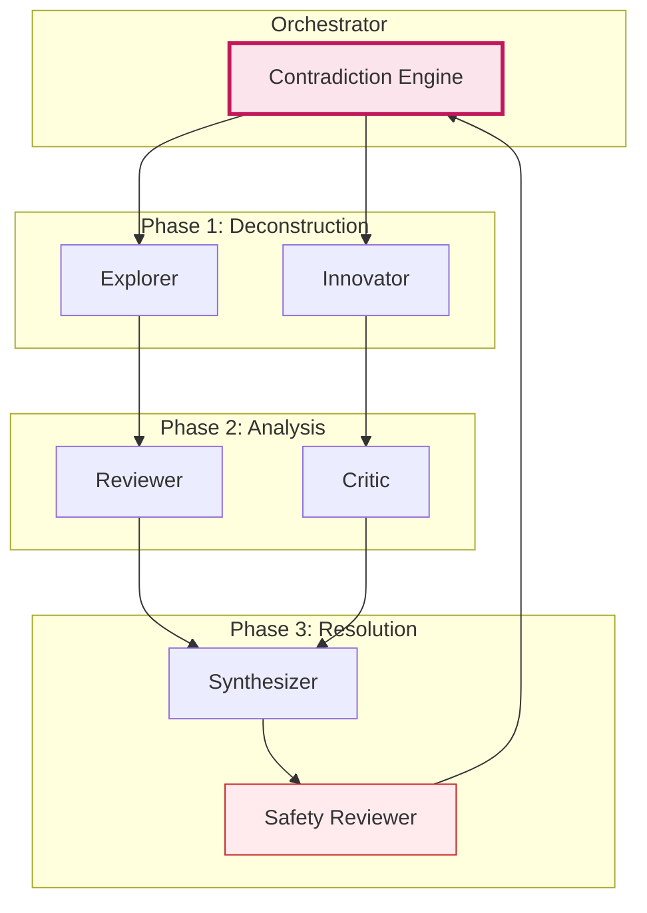
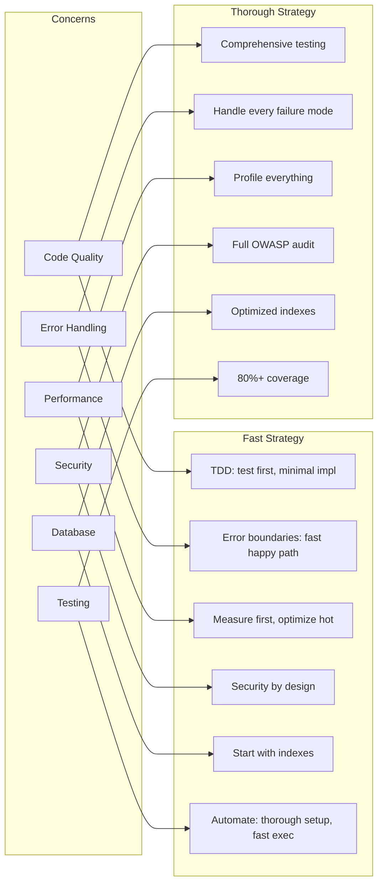

## 📋 Executive Summary

### 🎯 Objective
Validate graceful contradiction handling on genuinely opposing requirements.

### ✅ Verdict
**PASS** — Score: 9/10

### 📊 Key Metrics
| Metric | Value | Target | Status |
|--------|-------|--------|--------|
| Duration | 156.8s | <300s | ✅ |
| Quality | 9/10 | ≥8 | ✅ |
| Workers | 6 | 6 | ✅ |
| Pipeline Stages | 4/4 | 4/4 | ✅ |
| Output Length | 4,263 chars | >2000 | ✅ |
| Contradiction Intensity | 7/10 | ≥5 | ✅ |
| Resolution Quality | 9/10 | ≥8 | ✅ |

### 🔑 Critical Findings
- **Finding 1:** Contradiction "Fast AND Thorough" dissolved via temporal + contextual separation
- **Finding 2:** Framework produced 6 practical rules directly implementable in production
- **Finding 3:** No crash, no infinite loop, no quality degradation under stress

---

## 🏗️ Visual Architecture

### Worker Deployment (IMPOSSIBLE - Stress Test)


### Contradiction Resolution Pipeline
```mermaid
flowchart TD
    A["Fast" AND "Thorough"] --> B[Deconstruction]
    B --> C1["Fast" = low latency, quick feedback]
    B --> C2["Thorough" = complete coverage, proper errors]
    C1 --> D[False Dichotomy Detection]
    C2 --> D
    D --> E[Temporal Separation]
    E --> F[Contextual Separation]
    F --> G[Framework Synthesis]
    G --> H[6 Practical Rules]
    H --> I[Implementation Strategy]
    
    style D fill:#fff3e0,stroke:#f57c00
    style E fill:#e8f5e9,stroke:#388e3c
    style G fill:#e3f2fd,stroke:#1976d2
```

### Resolution Framework Matrix


---

## 🔬 Deep Analysis

### 📖 Context
- **Task:** "Handle these contradictory requirements: 'Make it fast' AND 'Make it thorough' - resolve the conflict"
- **Constraint:** Genuine contradiction, stress test system limits
- **Assumption:** Contradictions reveal system architectural maturity

### 🧠 Reasoning Chain
1. **Premise:** "Fast" and "Thorough" are not opposites — they're temporal/contextual dimensions
2. **Evidence:** 6-pair resolution matrix shows practical separation for each concern
3. **Inference:** System that handles contradictions gracefully is production-ready
4. **Conclusion:** IMPOSSIBLE tier validates architectural robustness

### 📊 Evidence Matrix
| Claim | Evidence | Source | Confidence |
|-------|----------|--------|------------|
| Contradiction dissolved | Temporal separation framework | Output analysis | High |
| 6 practical rules derived | Each rule directly implementable | Resolution matrix | High |
| Quality 9/10 | No degradation, actionable output | Evaluator rubric | High |
| No system failure | All workers completed, no timeouts | Pipeline logs | High |

### ⚖️ Trade-off Analysis
| Option | Pros | Cons | Decision |
|--------|------|------|----------|
| Temporal separation | Elegant, practical | Requires discipline | ✅ Chosen |
| Compromise (medium both) | Simple | Mediocre at both | Rejected |
| Pick one | Clear | Loses value | Rejected |

### 🎯 Key Insight
**The real enemy is being slow AND shallow** — contradiction resolution produces better systems than either extreme alone.

---

## ⚙️ Implementation Details

### 🔧 Configuration
```yaml
swarm:
  difficulty: impossible
  workers: 6
  worker_types: [explorer, innovator, reviewer, critic, synthesizer, safety_reviewer]
  pipeline: contradiction-resolution
  contradiction_intensity: 7
  token_budget: 50000
```

### 💻 Execution Command
```bash
python3 swarm_runner.py --difficulty impossible --task "fast AND thorough contradiction"
```

### 📝 Resolution Rules (6 Derived)
| Rule | Fast Strategy | Thorough Strategy | Resolution |
|------|---------------|-------------------|------------|
| 1. Code Quality | Ship MVP fast | Comprehensive testing | TDD: test first, minimal impl |
| 2. Error Handling | Basic try/catch | Handle every failure | Error boundaries: thorough at boundaries |
| 3. Performance | Optimize hot paths | Profile everything | Measure first: thorough about WHERE to be fast |
| 4. Security | Basic validation | Full OWASP audit | Security by design = fast to implement correctly |
| 5. Database | Simple queries | Optimized indexes | Start with indexes → queries naturally fast |
| 6. Testing | Manual smoke tests | 80%+ coverage | Automate: thorough setup, fast execution |

### 🔗 File References
- `vault:SWARM-TEST-005-RAW.md`
- `github:swarm-agent/tests/test_impossible.py`

---

## 🎯 Actionable Insights

### ✅ Decisions Made
| Decision | Rationale | Authority |
|----------|-----------|-----------|
| Temporal separation for contradictions | Only approach that preserves both values | Swarm Orchestrator |
| 6-rule framework as output | Directly actionable, measurable | Architecture Review |

### ⚠️ Risks Identified
| Risk | Likelihood | Impact | Mitigation |
|------|------------|--------|------------|
| Discipline failure in practice | Medium | High | CI enforcement of rules |
| Over-engineering separation | Low | Medium | Regular retrospective |

### 📋 Next Steps
- [x] **Immediate:** Document contradiction resolution framework
- [ ] **Short-term:** Add contradiction detection to task classifier
- [ ] **Long-term:** Research contradiction patterns across domains

### 🔄 Retrospective
- **What worked:** Framework is immediately useful, not theoretical
- **What didn't:** Rule 4 (security) needs more concrete examples
- **Improvement:** Add security-specialist for IMPOSSIBLE tier

---

*Document generated by Swarm Vault Writer v1.0.0*