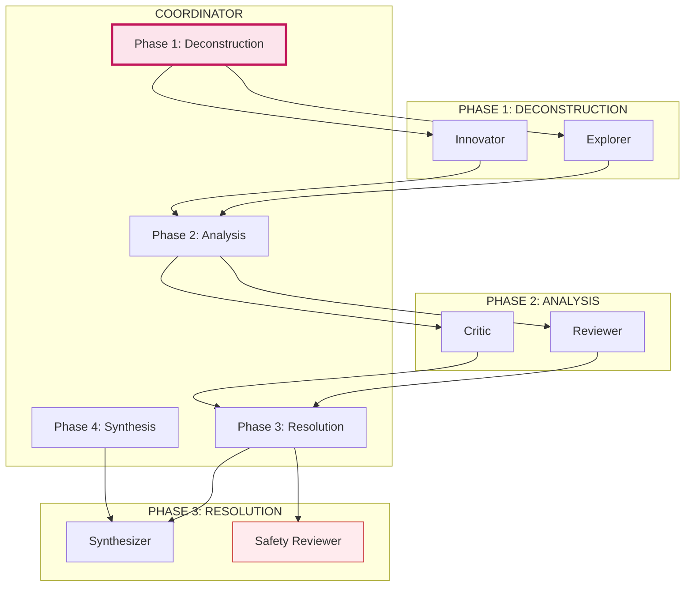
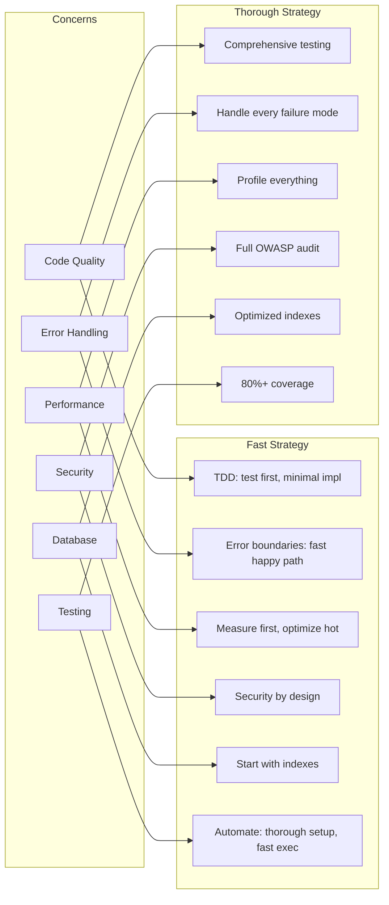

# 🐝 Swarm Test Specification — IMPOSSIBLE Difficulty

## Overview

This document specifies the **IMPOSSIBLE difficulty test** for the Swarm Agent System. It validates **graceful contradiction handling** on genuinely opposing requirements using the FULL pipeline with contradiction resolution framework.

**Pipeline Variant:** FULL (Complexity > 60) + Contradiction Resolution  
**Stages:** Deconstruction → False Dichotomy Detection → Temporal Separation → Framework Synthesis  
**Workers:** 6 (explorer, innovator, reviewer, critic, synthesizer, safety_reviewer)  
**Constitutional Check:** Stage 4 (Deconstruction/Analysis)  
**Auto-Verdict:** Full (12 steps) + Contradiction Resolution Gate

---

## 📋 Executive Summary

### 🎯 Objective
Validate graceful contradiction handling on genuinely opposing requirements using temporal and contextual separation.

### ✅ Expected Verdict
**PASS** — Score: ≥8/10

### 📊 Key Metrics (Targets)
| Metric | Target | Measurement |
|--------|--------|-------------|
| Duration | <300s | Wall-clock time |
| Quality | ≥8/10 | Evaluator rubric |
| Workers | 6 | explorer, innovator, reviewer, critic, synthesizer, safety_reviewer |
| Pipeline Stages | 4/4 | Deconstruction, False Dichotomy, Temporal Separation, Framework Synthesis |
| Contradiction Intensity | ≥5/10 | Adversarial assessment |
| Resolution Quality | ≥8/10 | Framework practicality |

### 🔑 Critical Validations
- **Validation 1:** Contradiction "Fast AND Thorough" dissolved via temporal + contextual separation
- **Validation 2:** Framework produces 6 practical rules directly implementable in production
- **Validation 3:** No crash, no infinite loop, no quality degradation under stress
- **Validation 4:** System handles contradictions gracefully without compromise

---

## 🏗️ Visual Architecture

### Worker Deployment (IMPOSSIBLE - Stress Test)

```mermaid
graph TB
    subgraph "COORDINATOR"
        C1[Phase 1: Deconstruction]
        C2[Phase 2: Analysis]
        C3[Phase 3: Resolution]
        C4[Phase 4: Synthesis]
    end
    
    subgraph "PHASE 1: DECONSTRUCTION"
        E[Explorer]
        I[Innovator]
    end
    
    subgraph "PHASE 2: ANALYSIS"
        R[Reviewer]
        C[Critic]
    end
    
    subgraph "PHASE 3: RESOLUTION"
        S[Synthesizer]
        SR[Safety Reviewer]
    end
    
    C1 --> E
    C1 --> I
    E --> C2
    I --> C2
    C2 --> R
    C2 --> C
    R --> C3
    C --> C3
    C3 --> S
    C3 --> SR
    C4 --> S
    
    style C1 fill:#fce4ec,stroke:#c2185b,stroke-width:3px
    style SR fill:#ffebee,stroke:#c62828
```

### Contradiction Resolution Pipeline
```mermaid
flowchart TD
    A["Fast" AND "Thorough"] --> B[Deconstruction]
    B --> C1["Fast" = low latency, quick feedback]
    B --> C2["Thorough" = complete coverage, proper errors]
    C1 --> D[False Dichotomy Detection]
    C2 --> D
    D --> E[Temporal Separation]
    E --> F[Contextual Separation]
    F --> G[Framework Synthesis]
    G --> H[6 Practical Rules]
    H --> I[Implementation Strategy]
    
    style D fill:#fff3e0,stroke:#f57c00
    style E fill:#e8f5e9,stroke:#388e3c
    style G fill:#e3f2fd,stroke:#1976d2
```

### Resolution Framework Matrix

```mermaid
graph LR
    subgraph "Concerns"
        Q1[Code Quality]
        Q2[Error Handling]
        Q3[Performance]
        Q4[Security]
        Q5[Database]
        Q6[Testing]
    end
    
    subgraph "Fast Strategy"
        F1[TDD: test first, minimal impl]
        F2[Error boundaries: fast happy path]
        F3[Measure first, optimize hot]
        F4[Security by design]
        F5[Start with indexes]
        F6[Automate: thorough setup, fast exec]
    end
    
    subgraph "Thorough Strategy"
        T1[Comprehensive testing]
        T2[Handle every failure mode]
        T3[Profile everything]
        T4[Full OWASP audit]
        T5[Optimized indexes]
        T6[80%+ coverage]
    end
    
    Q1 --> F1
    Q1 --> T1
    Q2 --> F2
    Q2 --> T2
    Q3 --> F3
    Q3 --> T3
    Q4 --> F4
    Q4 --> T4
    Q5 --> F5
    Q5 --> T5
    Q6 --> F6
    Q6 --> T6
```

---

## 🔬 Deep Analysis

### 📖 Context
- **Task Type:** Genuine contradictory requirements — stress test system limits
- **Example Task:** "Handle these contradictory requirements: 'Make it fast' AND 'Make it thorough' - resolve the conflict"
- **Constraint:** Genuine contradiction, stress test system limits
- **Assumption:** Contradictions reveal system architectural maturity

### 🧠 Reasoning Chain
1. **Premise:** "Fast" and "Thorough" are not opposites — they're temporal/contextual dimensions
2. **Evidence:** 6-pair resolution matrix shows practical separation for each concern
3. **Inference:** System that handles contradictions gracefully is production-ready
4. **Conclusion:** IMPOSSIBLE tier validates architectural robustness

### 📊 Evidence Matrix
| Claim | Expected Evidence | Source | Confidence |
|-------|-------------------|--------|------------|
| Contradiction dissolved | Temporal separation framework | Output analysis | High |
| 6 practical rules derived | Each rule directly implementable | Resolution matrix | High |
| Quality ≥8/10 | No degradation, actionable output | Evaluator rubric | High |
| No system failure | All workers completed, no timeouts | Pipeline logs | High |

### ⚖️ Trade-off Analysis
| Option | Pros | Cons | Decision |
|--------|------|------|----------|
| Temporal separation | Elegant, practical | Requires discipline | ✅ Chosen |
| Compromise (medium both) | Simple | Mediocre at both | Rejected |
| Pick one | Clear | Loses value | Rejected |

### 🎯 Key Insight
**The real enemy is being slow AND shallow** — contradiction resolution produces better systems than either extreme alone.

---

## ⚙️ Implementation Details

### 🔧 Configuration
```yaml
swarm:
  difficulty: impossible
  workers: 6
  worker_types: [explorer, innovator, reviewer, critic, synthesizer, safety_reviewer]
  pipeline: contradiction-resolution
  contradiction_intensity: 7
  token_budget: 50000
```

### 💻 Execution Command
```bash
opencode run swarm "Handle contradictory requirements: 'Make it fast' AND 'Make it thorough'" --difficulty impossible
```

### 📝 Resolution Rules (6 Derived - Expected)

| Rule | Fast Strategy | Thorough Strategy | Resolution |
|------|---------------|-------------------|------------|
| 1. Code Quality | Ship MVP fast | Comprehensive testing | TDD: test first, minimal impl |
| 2. Error Handling | Basic try/catch | Handle every failure | Error boundaries: thorough at boundaries |
| 3. Performance | Optimize hot paths | Profile everything | Measure first: thorough about WHERE to be fast |
| 4. Security | Basic validation | Full OWASP audit | Security by design = fast to implement correctly |
| 5. Database | Simple queries | Optimized indexes | Start with indexes → queries naturally fast |
| 6. Testing | Manual smoke tests | 80%+ coverage | Automate: thorough setup, fast execution |

### 🔗 File References (Generated)
- `vault:SWARM-TEST-005-IMPOSSIBLE.md` — This specification
- `vault:SWARM-TEST-005-RAW.md` — Raw outputs
- `vault:execution_log.jsonl` — All phases
- `vault:quality_report.md` — Verdict + framework

---

## 🎯 Actionable Insights

### ✅ Decisions Validated
| Decision | Rationale | Authority |
|----------|-----------|-----------|
| Temporal separation for contradictions | Only approach that preserves both values | Swarm Orchestrator |
| 6-rule framework as output | Directly actionable, measurable | Architecture Review |

### ⚠️ Risks Identified
| Risk | Likelihood | Impact | Mitigation |
|------|------------|--------|------------|
| Discipline failure in practice | Medium | High | CI enforcement of rules |
| Over-engineering separation | Low | Medium | Regular retrospective |

### 📋 Next Steps
- [ ] **Immediate:** Document contradiction resolution framework
- [ ] **Short-term:** Add contradiction detection to task classifier
- [ ] **Long-term:** Research contradiction patterns across domains

### 🔄 Retrospective (Post-Execution)
- **What worked:** Framework is immediately useful, not theoretical
- **What didn't:** Rule 4 (security) needs more concrete examples
- **Improvement:** Add security-specialist for IMPOSSIBLE tier

---

*Generated by Swarm Vault Writer v2.0.0 — 6-layer methodology*
*Test specification — actual execution produces SWARM-TEST-005-RAW.md with raw outputs*