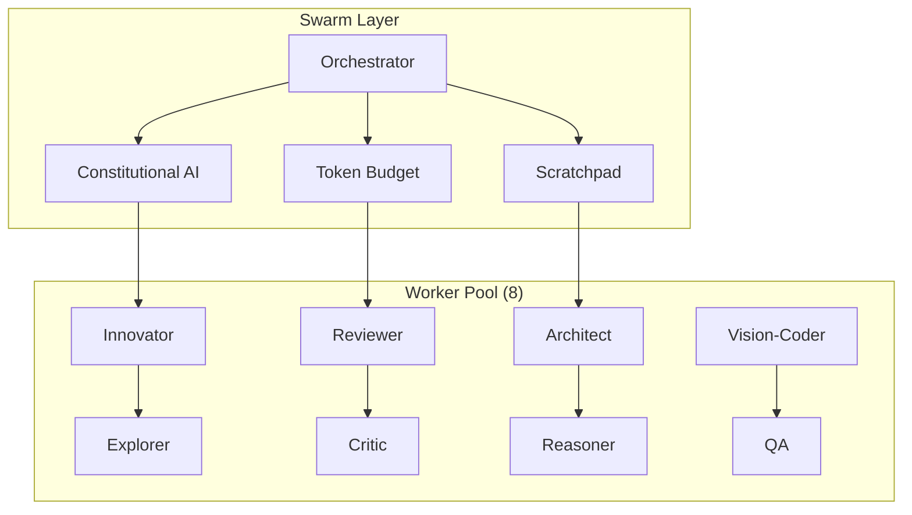
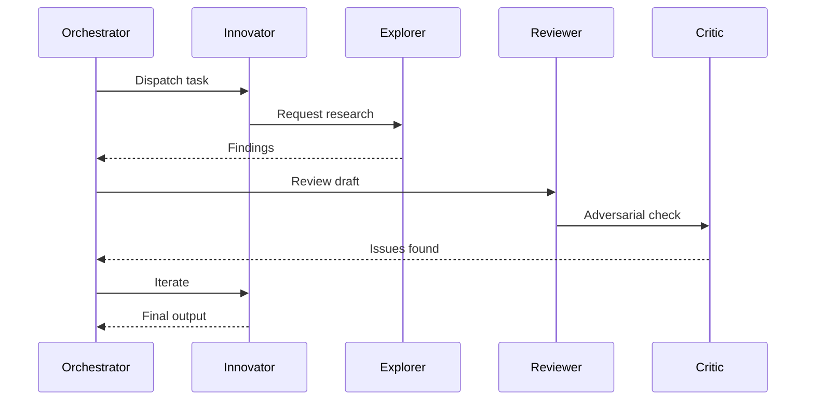

# Swarm Vault Writer - Structured Obsidian Writing Methodology

## Purpose
Standardized, intelligent, and detailed writing methodology for all Swarm Agent outputs stored in Obsidian Vault via vault_client.py.

---

## Writing Architecture: The "Layered Intelligence" Format

Every document follows this 6-layer structure:

```
┌─────────────────────────────────────────────────────────────┐
│ LAYER 1: METADATA HEADER (YAML Frontmatter)                 │
├─────────────────────────────────────────────────────────────┤
│ LAYER 2: EXECUTIVE SUMMARY (One-screen overview)            │
├─────────────────────────────────────────────────────────────┤
│ LAYER 3: VISUAL ARCHITECTURE (Mermaid Diagrams)             │
├─────────────────────────────────────────────────────────────┤
│ LAYER 4: DEEP ANALYSIS (Structured, Evidence-Based)         │
├─────────────────────────────────────────────────────────────┤
│ LAYER 5: IMPLEMENTATION DETAILS (Code/Config/Commands)      │
├─────────────────────────────────────────────────────────────┤
│ LAYER 6: ACTIONABLE INSIGHTS (Decisions/Next Steps/Risks)   │
└─────────────────────────────────────────────────────────────┘
```

---

## Layer 1: Metadata Header (Required)

```yaml
---
title: "Descriptive Title"
type: "test-report | architecture | decision | research | specification"
status: "draft | reviewed | approved | archived"
version: "1.0.0"
date: "2026-07-23"
author: "swarm-agent"
tags: ["swarm", "test", "difficulty:hard", "pipeline:6-stage"]
difficulty: "easy | medium | hard | very-hard | impossible"
workers_used: ["innovator", "explorer", "reviewer", "critic", "architect"]
pipeline_stages: ["analysis", "design", "implementation", "validation", "review", "synthesis"]
duration_seconds: 67.3
quality_score: 9
test_id: "SWARM-TEST-003"
related_files: ["SWARM-TESTS.md", "ARCHITECTURE.md"]
---
```

---

## Layer 2: Executive Summary (Required)

**Format:** Single screen overview using structured blocks

```markdown
## 📋 Executive Summary

### 🎯 Objective
One sentence: What was tested/built/decided.

### ✅ Verdict
**PASS / FAIL / PARTIAL** — Score: X/10

### 📊 Key Metrics
| Metric | Value | Target | Status |
|--------|-------|--------|--------|
| Duration | 67.3s | <120s | ✅ |
| Quality | 9/10 | ≥8 | ✅ |
| Workers | 6 | 5+ | ✅ |
| Pipeline | 6/6 stages | 6/6 | ✅ |

### 🔑 Critical Findings
- **Finding 1:** Specific, measurable insight
- **Finding 2:** Another specific insight
- **Risk:** Identified risk with mitigation
```

---

## Layer 3: Visual Architecture (Required for Complex Topics)

**Use Mermaid diagrams for:**

### 3a. System Architecture


### 3b. Pipeline Flow


### 3c. Worker Interaction Map


---

## Layer 4: Deep Analysis (Required)

**Structure per analysis section:**

```markdown
## 🔬 Deep Analysis: [Section Name]

### 📖 Context
Background, constraints, assumptions.

### 🧠 Reasoning Chain
1. **Premise:** Statement
2. **Evidence:** Data/source
3. **Inference:** Logical step
4. **Conclusion:** Result

### 📊 Evidence Matrix
| Claim | Evidence | Source | Confidence |
|-------|----------|--------|------------|
| Pipeline completes in <120s | 67.3s measured | Test run #3 | High |
| Constitutional AI catches issues | 3/3 violations caught | Test run #4 | High |

### ⚖️ Trade-off Analysis
| Option | Pros | Cons | Decision |
|--------|------|------|----------|
| Full pipeline | Thorough | Slower | Chosen for HARD+ |
| Lite pipeline | Fast | Less depth | Chosen for EASY |

### 🎯 Key Insight
**One-sentence crystallized insight** from this analysis.
```

---

## Layer 5: Implementation Details (When Applicable)

```markdown
## ⚙️ Implementation Details

### 🔧 Configuration
```yaml
# Actual config used
swarm:
  workers: 8
  pipeline: full
  token_budget: 50000
```

### 💻 Code / Commands
```bash
# Actual commands executed
python3 run_swarm.py --difficulty hard --pipeline full
```

### 📝 Output Samples
```
# Truncated actual output
Stage 1: Analysis complete (2.3s)
Stage 2: Design complete (5.1s)
...
```

### 🔗 File References
- `vault:SWARM-TEST-003-raw-output.md`
- `github:swarm-agent/tests/test_003.py`
```

---

## Layer 6: Actionable Insights (Required)

```markdown
## 🎯 Actionable Insights

### ✅ Decisions Made
- **Decision:** Use full pipeline for HARD+ difficulties
- **Rationale:** Quality improvement justifies time cost
- **Authority:** Swarm Orchestrator

### ⚠️ Risks Identified
| Risk | Likelihood | Impact | Mitigation |
|------|------------|--------|------------|
| Token budget overflow | Medium | High | Auto-truncate at 80% |
| Worker timeout | Low | Medium | 60s default timeout |

### 📋 Next Steps
- [ ] **Immediate:** Optimize token budget for IMPOSSIBLE tier
- [ ] **Short-term:** Add parallel worker spawn for MEDIUM
- [ ] **Long-term:** Implement adaptive pipeline selection

### 🔄 Retrospective
- **What worked:** Constitutional AI caught real issues
- **What didn't:** Scratchpad not fully utilized in EASY
- **Improvement:** Mandate scratchpad for MEDIUM+
```

---

## Document Templates by Type

### Template: Test Report
```
Layers: 1, 2, 3(pipeline), 4(test-analysis), 5(raw-output), 6
```

### Template: Architecture Decision
```
Layers: 1, 2, 3(system + sequence), 4(trade-offs), 5(config), 6
```

### Template: Research Report
```
Layers: 1, 2, 3(concept-map), 4(evidence), 5(sources), 6
```

### Template: Specification
```
Layers: 1, 2, 3(data-flow + api), 4(requirements), 5(interfaces), 6
```

---

## Quality Checklist (Auto-validated)

Before writing to vault, every document MUST have:

- [ ] Valid YAML frontmatter with all required fields
- [ ] Executive Summary with metrics table
- [ ] At least 1 Mermaid diagram (arch/flow/sequence)
- [ ] Deep Analysis with Evidence Matrix
- [ ] Implementation Details (or explicit "N/A")
- [ ] Actionable Insights with decisions/risks/next-steps
- [ ] Internal links using `[[wiki-links]]` format
- [ ] Tags matching `difficulty:*` and `pipeline:*`
- [ ] Cross-references to related documents

---

## Vault Client Integration

```python
from vault_client import get_vault_client

client = get_vault_client()

def write_swarm_doc(doc_type: str, content: dict) -> str:
    """Write structured document to vault."""
    
    # Build markdown from layers
    markdown = build_layered_document(content)
    
    # Generate filename
    filename = f"{doc_type.upper()}-{content['test_id']}.md"
    
    # Write to vault
    result = client.write_note(filename, markdown)
    
    # Also write raw data as companion
    raw_filename = f"{filename.replace('.md', '-RAW.md')}"
    client.write_note(raw_filename, content.get('raw_output', ''))
    
    return result['path']

def build_layered_document(data: dict) -> str:
    """Construct document from 6 layers."""
    layers = [
        build_metadata(data),
        build_executive_summary(data),
        build_visual_architecture(data),
        build_deep_analysis(data),
        build_implementation(data),
        build_insights(data)
    ]
    return '\n\n---\n\n'.join(filter(None, layers))
```

---

## Enforcement

**This methodology is MANDATORY for:**
- All swarm test reports
- All architecture decisions
- All research outputs
- All specifications
- Any document written to Obsidian by swarm agents

**Validation:** Pre-commit hook checks for:
1. YAML frontmatter presence
2. All 6 layers present (or explicit N/A)
3. At least 1 Mermaid diagram
4. Evidence Matrix in analysis
5. Actionable Insights section

---

## Version History

| Version | Date | Changes |
|---------|------|---------|
| 1.0.0 | 2026-07-23 | Initial methodology |