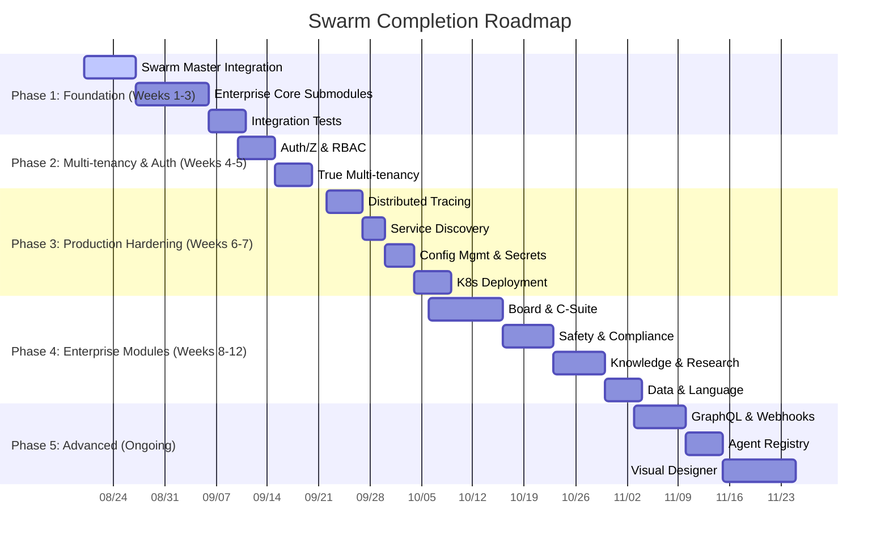

# 🐝 Swarm System - Master Completion Plan

> **Version:** 2.0 | **Status:** Memory V2 (100%) + Job System Stage 1&2 (Complete) | **Last Updated:** 2025-08-20

---

## 📊 Executive Summary

| Metric | Current | Target |
|--------|---------|--------|
| **Memory V2 (MEM-IDs)** | ✅ 21/21 (100%) | 100% |
| **Job System** | ✅ Stage 1&2 Complete | Stage 3 (Advanced) |
| **Enterprise Core** | 🔴 ~15% (stubs only) | 100% |
| **Enterprise Modules** | 🔴 0% (empty) | 100% |
| **Integration Tests** | 🔴 0% | 100% |
| **Production Ready** | 🟡 ~40% | 100% |
| **Unit Tests** | ✅ 497 passing | Maintain >95% |

---

## 🎯 Phase Overview



---

## 📋 Phase 1: Foundation (Critical - Weeks 1-3)

### **1.1 Swarm Master Integration** ⏱️ 7 days | 🔴 **P0 - BLOCKER**

**Objective:** Make `swarm_master.py` the actual orchestrator connecting all agents.

| Task | Owner | Days | Dependencies | Done Criteria |
|------|-------|------|--------------|---------------|
| 1.1.1 Define Agent Registry interface | Backend | 1 | - | `AgentRegistry` class with register/discover/health |
| 1.1.2 Implement Task Dispatcher | Backend | 2 | 1.1.1 | Routes tasks to agents via `inter_agent_bus` |
| 1.1.3 Add Agent Lifecycle Management | Backend | 2 | 1.1.1 | Start/stop/restart/scale agents |
| 1.1.4 Connect to Job System | Backend | 1 | Job System ✅ | Submit workflows via `CompensationEngine` |
| 1.1.5 Connect to Memory V2 | Backend | 1 | Memory V2 ✅ | Context assembly via `MemoryFabric` |

**Files to Create/Modify:**
- `swarm/enterprise/swarm_master.py` (major rewrite)
- `swarm/enterprise/core/orchestration/` (new submodule)

---

### **1.2 Enterprise Core Submodules** ⏱️ 10 days | 🔴 **P0 - BLOCKER**

**Objective:** Fill all 11 empty submodules with working implementations.

| Submodule | Priority | Key Features | Est. Days |
|-----------|----------|--------------|-----------|
| **governance** | P0 | Policy enforcement, compliance checks, audit trails | 2 |
| **orchestration** | P0 | Workflow orchestration, saga coordination, compensation | 2 |
| **memory** | P0 | Enterprise Memory V2 integration, multi-tenant contexts | 1 |
| **observability** | P0 | Unified metrics, tracing, logging, alerting | 2 |
| **routing** | P1 | Intelligent agent/task routing, load balancing | 1 |
| **policy** | P1 | Dynamic policy engine, feature flags | 1 |
| **state** | P1 | Distributed state management, consensus | 1 |
| **artifact** | P2 | Artifact storage, versioning, provenance | 1 |
| **audit** | P2 | Unified audit trail, immutable logs | 1 |
| **budget** | P2 | Budget tracking, allocation, alerts | 1 |
| **execution** | P2 | Code execution sandbox, resource limits | 1 |

**Implementation Pattern per Submodule:**
```
swarm/enterprise/core/{submodule}/
├── __init__.py          # Public API exports
├── models.py            # Data models
├── service.py           # Business logic
├── repository.py        # Persistence (uses JobRepository pattern)
├── api.py               # REST/gRPC endpoints
├── tests/
│   ├── test_unit.py
│   └── test_integration.py
```

---

### **1.3 Integration Tests** ⏱️ 5 days | 🔴 **P0 - BLOCKER**

**Objective:** Create `tests/integration/` with end-to-end scenarios.

| Test Scenario | Components Tested | Priority |
|---------------|-------------------|----------|
| **IT-01:** Agent Registration → Task Dispatch → Execution → Result | Swarm Master, Agent Registry, Job System | P0 |
| **IT-02:** Memory Write → Promotion → Search → Context Assembly | Memory V2 (all layers) | P0 |
| **IT-03:** Workflow with Compensation → Failure → Rollback → DLQ | Job System (full) | P0 |
| **IT-04:** Scheduled Job → Recurring → DLQ on Failure | Scheduler + DLQ + Metrics | P1 |
| **IT-05:** Multi-tenant Isolation (jobs, memory, rate limits) | Tenant isolation across all systems | P1 |
| **IT-06:** Circuit Breaker → Fallback → Recovery | Resilience patterns | P1 |
| **IT-07:** Constitutional Guard → Audit → Alert | Intelligence + Observability | P1 |

**Structure:**
```
tests/integration/
├── conftest.py              # Shared fixtures
├── test_agent_lifecycle.py
├── test_memory_pipeline.py
├── test_job_workflow.py
├── test_scheduler_dlq.py
├── test_multitenant.py
├── test_resilience.py
├── test_intelligence.py
└── fixtures/
    ├── sample_agents.py
    ├── sample_workflows.py
    └── test_data.py
```

---

## 📋 Phase 2: Multi-tenancy & Auth (Weeks 4-5)

### **2.1 Authentication & Authorization** ⏱️ 5 days | 🟠 **P1**

| Task | Details |
|------|---------|
| **2.1.1** OAuth2/OIDC Provider Integration | Keycloak, Auth0, Azure AD support |
| **2.1.2** JWT Token Management | Access/refresh tokens, rotation, revocation |
| **2.1.3** RBAC System | Roles: admin, operator, developer, viewer; Permissions per resource |
| **2.1.4** API Key Management | Scoped keys, rotation, expiration |
| **2.1.5** Session Management | Distributed sessions, single sign-out |

**Files:**
- `swarm/enterprise/core/auth/` (expand from stub)
- `swarm/api/auth.py` (enhance)

---

### **2.2 True Multi-tenancy** ⏱️ 5 days | 🟠 **P1**

| Layer | Current | Target |
|-------|---------|--------|
| **Job System** | ✅ Tenant isolation | ✅ |
| **Memory V2** | ✅ Tenant in metadata | ✅ Namespace isolation |
| **Rate Limiter** | ✅ Per-tenant config | ✅ |
| **Scheduler** | ✅ Per-tenant schedules | ✅ |
| **DLQ** | ✅ Per-tenant entries | ✅ |
| **Swarm Master** | ❌ | Agent registry per tenant |
| **Enterprise Core** | ❌ | All submodules tenant-aware |
| **API Gateway** | ❌ | Tenant routing, quotas |

---

## 📋 Phase 3: Production Hardening (Weeks 6-7)

### **3.1 Distributed Tracing (OpenTelemetry)** ⏱️ 5 days | 🟠 **P1**

| Component | Implementation |
|-----------|----------------|
| **Trace Context Propagation** | W3C TraceContext headers across all services |
| **Span Instrumentation** | Auto-instrument: HTTP, DB, Redis, Message queues |
| **Custom Spans** | Job execution, workflow steps, memory operations |
| **Exporters** | Jaeger, Zipkin, OTLP (configurable) |
| **Sampling** | Probabilistic + rule-based (errors always sampled) |

**Files:**
- `swarm/observability/tracing.py` (new)
- Update all core modules to emit spans

---

### **3.2 Service Discovery** ⏱️ 3 days | 🟠 **P1**

| Feature | Implementation |
|---------|----------------|
| **Registry** | Consul / etcd / Redis-backed |
| **Health Checks** | Active + passive health checks |
| **Load Balancing** | Client-side (random/round-robin/least-connections) |
| **Agent Registration** | Auto-register on startup, deregister on shutdown |

---

### **3.3 Configuration Management & Secrets** ⏱️ 4 days | 🟠 **P1**

| Feature | Implementation |
|---------|----------------|
| **Config Source** | File (YAML/TOML) + Environment + Consul/etcd |
| **Hot Reload** | Watch for changes, notify subscribers |
| **Feature Flags** | Per-tenant, percentage rollout, targeting rules |
| **Secrets** | HashiCorp Vault integration, AWS Secrets Manager, Azure Key Vault |
| **Rotation** | Automatic rotation with grace period |

**Files:**
- `swarm/enterprise/core/config/` (new)
- `swarm/enterprise/core/secrets/` (new)

---

### **3.4 Kubernetes Deployment** ⏱️ 5 days | 🟠 **P1**

| Artifact | Description |
|----------|-------------|
| **Helm Chart** | `helm/swarm/` with values.yaml for dev/staging/prod |
| **Deployments** | API, Workers, Scheduler, Swarm Master, Memory |
| **Services** | ClusterIP, LoadBalancer for ingress |
| **ConfigMaps/Secrets** | Config + secrets management |
| **HPA/VPA** | Horizontal/Vertical Pod Autoscaling |
| **NetworkPolicies** | Zero-trust network policies |
| **PodDisruptionBudgets** | High availability |
| **Monitoring** | ServiceMonitors, PrometheusRules, Grafana dashboards |

---

## 📋 Phase 4: Enterprise Modules (Weeks 8-12)

### **4.1 Board & C-Suite** ⏱️ 10 days | 🟢 **P2**

#### **Board Module**
| Feature | Description |
|---------|-------------|
| **Meeting Management** | Schedule, agenda, minutes, action items |
| **Decision Recording** | Proposals, voting, quorum, audit trail |
| **Governance Dashboard** | KPIs, risk register, compliance status |
| **Document Management** | Board packs, resolutions, policies |

#### **C-Suite Agents**
| Agent | Responsibilities |
|-------|------------------|
| **CEO** | Strategic planning, OKR tracking, stakeholder communication |
| **CFO** | Budget allocation, financial forecasting, cost optimization |
| **CTO** | Architecture decisions, tech debt tracking, innovation radar |
| **COO** | Resource allocation, operational efficiency, vendor management |
| **CMO** | Growth metrics, campaign orchestration, brand governance |

---

### **4.2 Safety & Compliance** ⏱️ 7 days | 🟢 **P2**

| Feature | Implementation |
|---------|----------------|
| **Content Moderation** | Toxicity, PII, secrets, malware scanning |
| **Compliance Engine** | GDPR, SOC2, HIPAA, PCI-DSS rule sets |
| **Data Governance** | Data lineage, retention, deletion workflows |
| **Incident Response** | Playbooks, runbooks, automated containment |
| **Audit Reports** | Automated compliance reporting |

---

### **4.3 Knowledge & Research** ⏱️ 7 days | 🟢 **P2**

| Module | Features |
|--------|----------|
| **Knowledge** | Graph construction, document ingestion, semantic search, validation |
| **Research** | Literature review, hypothesis tracking, experiment management |
| **Language** | Multi-lingual support, translation, localization |

---

### **4.4 Data & Language** ⏱️ 5 days | 🟢 **P2**

| Module | Features |
|--------|----------|
| **Data** | Pipeline orchestration, quality checks, lineage |
| **Video** | Transcoding, analysis, streaming |

---

## 📋 Phase 5: Advanced Features (Ongoing)

### **5.1 GraphQL API & Webhooks** ⏱️ 7 days | 🟢 **P3**

| Feature | Details |
|---------|---------|
| **GraphQL Gateway** | Schema stitching from REST services |
| **Subscriptions** | Real-time updates via WebSocket |
| **Webhooks** | Event delivery with retry, dead letter, signing |
| **Event Catalog** | Self-describing event schemas |

---

### **5.2 Agent Registry & Marketplace** ⏱️ 5 days | 🟢 **P3**

| Feature | Details |
|---------|---------|
| **Registry** | Agent discovery, versioning, dependencies |
| **Marketplace** | Publish, install, rate, review agents |
| **Sandbox** | Secure agent execution environment |
| **Monetization** | Usage tracking, billing integration |

---

### **5.3 Visual Workflow Designer** ⏱️ 10 days | 🟢 **P3**

| Feature | Details |
|---------|---------|
| **Drag-and-Drop UI** | React Flow / Cytoscape based |
| **Workflow Validation** | Real-time dependency checking |
| **Template Library** | Pre-built workflow templates |
| **Version Control** | Git-backed workflow versions |
| **Debug/Replay** | Step-through execution visualization |

---

## ✅ Success Criteria by Phase

### **Phase 1 Complete When:**
- [ ] Swarm Master routes tasks to 3+ agent types
- [ ] All 11 Enterprise Core submodules have unit tests (>80% coverage)
- [ ] 7 integration tests passing in CI
- [ ] Zero critical bugs in integration test suite

### **Phase 2 Complete When:**
- [ ] OAuth2 login works with Keycloak
- [ ] RBAC enforced on all API endpoints
- [ ] Multi-tenant isolation verified by penetration test
- [ ] Tenant quotas enforced (jobs, memory, rate limits)

### **Phase 3 Complete When:**
- [ ] Distributed traces visible in Jaeger for full request flow
- [ ] Services auto-discover via Consul
- [ ] Config changes apply without restart
- [ ] Secrets rotate automatically
- [ ] Helm chart deploys to K8s cluster successfully

### **Phase 4 Complete When:**
- [ ] Board meeting can be scheduled, conducted, minutes generated
- [ ] C-Suite agents respond to queries with relevant actions
- [ ] Compliance scan passes for GDPR/SOC2
- [ ] Knowledge graph answers natural language queries

---

## 🔗 Dependencies Map

```
Phase 1 (Foundation)
├── 1.1 Swarm Master ──┬──→ Phase 2 (Auth needs Master for agent auth)
├── 1.2 Enterprise Core ──┬──→ Phase 2 (Auth needs submodules)
├── 1.3 Integration Tests ──┬──→ All Phases (regression prevention)
│
Phase 2 (Multi-tenancy)
├── 2.1 Auth ──┬──→ Phase 3 (Tracing needs auth context)
├── 2.2 Multi-tenancy ──┬──→ Phase 3 (K8s needs tenant isolation)
│
Phase 3 (Production)
├── 3.1 Tracing ──┬──→ Phase 4 (Enterprise modules need observability)
├── 3.2 Service Discovery ──┬──→ Phase 4 (Agents need discovery)
├── 3.3 Config/Secrets ──┬──→ Phase 4 (Modules need config)
├── 3.3 K8s ──┬──→ Phase 4 (Deployment target)
│
Phase 4 (Enterprise)
├── 4.1 Board/C-Suite ──┬──→ Phase 5 (Agents need registry)
├── 4.2 Safety ──┬──→ Phase 5 (Marketplace needs safety)
├── 4.3 Knowledge ──┬──→ Phase 5 (Designer needs knowledge)
│
Phase 5 (Advanced) ──→ Independent, can start after Phase 2
```

---

## 📦 Resource Requirements

| Role | Phase 1 | Phase 2 | Phase 3 | Phase 4 | Phase 5 |
|------|---------|---------|---------|---------|---------|
| **Backend Engineers** | 3 | 2 | 2 | 3 | 2 |
| **DevOps/Platform** | 1 | 1 | 3 | 1 | 1 |
| **Security Engineer** | 0 | 1 | 1 | 1 | 0 |
| **QA/Integration** | 1 | 1 | 1 | 1 | 1 |
| **Frontend (for Phase 5)** | 0 | 0 | 0 | 0 | 2 |

---

## 🚨 Risk Register

| Risk | Likelihood | Impact | Mitigation |
|------|------------|--------|------------|
| **Enterprise Core complexity underestimated** | High | High | Start with governance + orchestration (highest value) |
| **Integration test flakiness** | High | Medium | Invest in test infrastructure early (testcontainers, mocks) |
| **Multi-tenancy performance regression** | Medium | High | Load test each layer at 10x expected load |
| **K8s deployment complexity** | Medium | Medium | Start with kind/k3d local, then EKS/GKE |
| **Agent sandbox security** | Low | Critical | Use gVisor/Firecracker, not just containers |

---

## 📝 Quick Start for New Contributors

```bash
# 1. Clone & Setup
git clone https://github.com/MohamedNamper333/swarm-agent.git
cd swarm-agent
pip install -e ".[dev]"

# 2. Run Tests
pytest tests/unit/ -v          # 497 tests
pytest tests/enterprise/ -v    # 12 tests (some need NVIDIA_API_KEY)

# 3. Start Development
cp .env.example .env           # Add NVIDIA_API_KEY
python -m swarm.api.rest_server # Start API
python -m swarm.enterprise.swarm_master # Start Master (Phase 1)

# 4. Check Architecture
python -c "from swarm.memory.v2 import create_memory_fabric; print('Memory V2 OK')"
python -c "from swarm.enterprise.core.job import Worker; print('Job System OK')"
```

---

## 📚 Related Documents

| Document | Purpose |
|----------|---------|
| `ARCHITECTURE.md` | System architecture overview |
| `ADR/` | Architecture Decision Records |
| `docs/MEMORY_V2_SPEC.md` | Memory V2 specification |
| `docs/JOB_SYSTEM_SPEC.md` | Job System specification |
| `docs/API_REFERENCE.md` | REST/gRPC API reference |

---

## 🏁 Definition of Done (Project Level)

The Swarm System is **Production Ready** when:

1. ✅ **Memory V2** - 21/21 MEM-IDs implemented, tested, documented
2. ✅ **Job System** - Persistent queue, scheduling, DLQ, rate limiting, metrics
3. 🔄 **Swarm Master** - Orchestrates 5+ agent types with full lifecycle management
4. 🔄 **Enterprise Core** - All 11 submodules functional with >80% test coverage
5. 🔄 **Enterprise Modules** - Board, C-Suite, Safety, Knowledge, Data, Language operational
6. 🔄 **Multi-tenancy** - Full isolation verified by 3rd party penetration test
7. 🔄 **Auth/Z** - OAuth2/OIDC + RBAC enforced everywhere
8. 🔄 **Observability** - Distributed tracing, metrics, alerting, dashboards
9. 🔄 **Deployment** - Helm chart deploys to K8s with HA, autoscaling, zero-downtime
10. 🔄 **Integration Tests** - 20+ E2E scenarios passing in CI/CD

---

**Next Action:** Start **Phase 1.1 - Swarm Master Integration** 

> This is the linchpin that connects all completed work (Memory V2, Job System) into a functioning multi-agent system.

---

*Document maintained by: Swarm Engineering Team*  
*Review cadence: Weekly during active development*  
*Next review: 2025-08-27*
