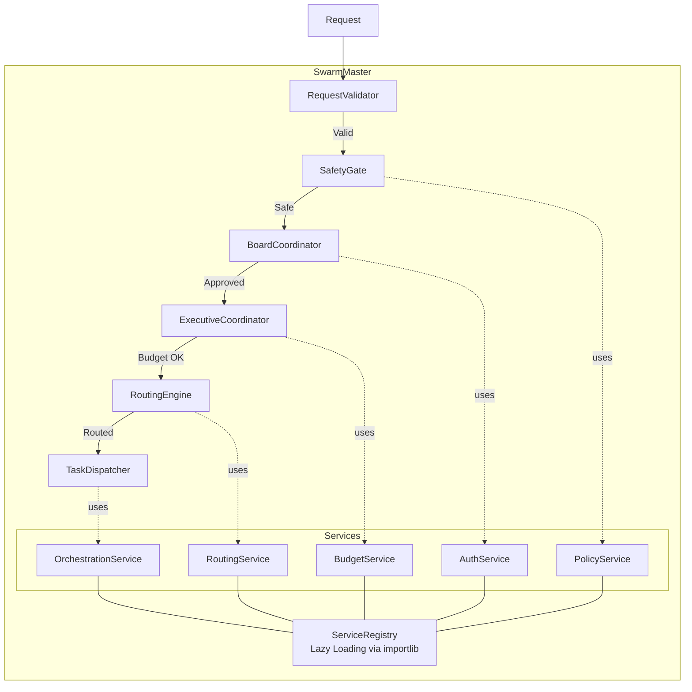

# C4 Model - Level 3: Component Diagram (SwarmMaster)



## Components

| Component | Responsibility | Dependencies (via Registry) |
|-----------|---------------|----------------------------|
| RequestValidator | Validates request format and size | None |
| SafetyGate | Runs safety department + policy check | PolicyService, SafetyDept |
| BoardCoordinator | Coordinates board deliberation (VETO power) | AuthService |
| ExecutiveCoordinator | C-Suite executive meeting + budget reservation | BudgetService, CostService |
| RoutingEngine | Routes to appropriate department | RoutingService |
| TaskDispatcher | Dispatches to agent with circuit breaker | OrchestrationService |
| ServiceRegistry | Lazy service lookup via `importlib.import_module()` | None (root) |

## Key Design Decision
All components access core services through the **ServiceRegistry** with lazy loading:
```python
service = self.service_registry.get("policy")  # Returns adapter
# Adapter lazily imports: from swarm.enterprise.core.policy.engine import PolicyEngine
```
This breaks circular imports and enables independent testing.
