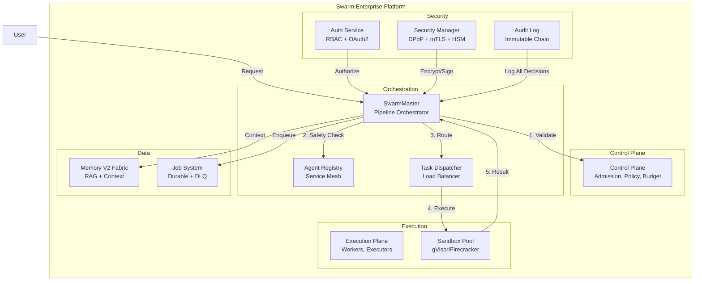

# C4 Model - Level 2: Container Diagram

## Containers

| Container | Technology | Responsibility | Scaling |
|-----------|-----------|----------------|---------|
| SwarmMaster | Python/asyncio | Pipeline orchestration (Safety→Board→CSuite→Route→Execute) | 3-10 replicas |
| Control Plane | Python | Admission control, policy enforcement, budget checks | 3 replicas |
| Agent Registry | In-process | Service mesh for agent discovery and health | Embedded |
| Task Dispatcher | In-process | Task routing with circuit breaker | Embedded |
| Execution Plane | Python/sandbox | Isolated code execution | 3-10 replicas |
| Sandbox Pool | gVisor/Firecracker | Strong isolation for user code | Auto-scaled |
| Memory V2 | Python + pluggable backend | Context assembly, RAG search | 3 replicas |
| Job System | Python + Redis/PostgreSQL | Durable job execution with compensation | Workers auto-scale |
| Auth Service | Python + JWT/OAuth2 | Authentication, RBAC, token management | 3 replicas |
| Security Manager | Python + cryptography | DPoP, mTLS, HSM, key rotation | 3 replicas |
| Audit Log | Python + SHA-256 chain | Immutable audit trail | Append-only |
