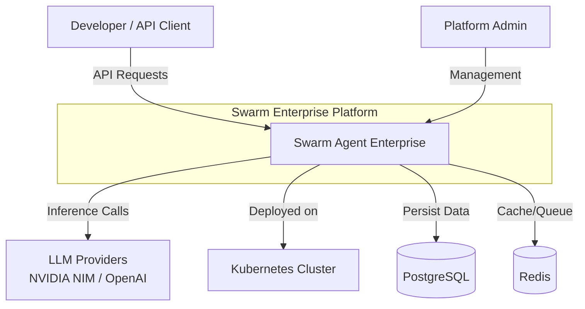

# C4 Model - Level 1: System Context

## Description
The Swarm Agent Enterprise Platform is a multi-tenant code execution platform that:
- Accepts code execution requests from developers via API
- Routes them through a safety/board/c-suite governance pipeline
- Executes in isolated sandboxes (gVisor/Firecracker)
- Records all decisions in an immutable audit log

## External Systems
| System | Purpose | Protocol |
|--------|---------|----------|
| LLM Providers | AI inference for agents | HTTPS/REST |
| Kubernetes | Container orchestration | K8s API |
| PostgreSQL | Persistent storage, job repository | TCP/5432 |
| Redis | Cache, rate limiting, job queue | TCP/6379 |
